# SIGMA (Σ) - Self-Evolving Developer Intelligence

> **Your code's memory, evolving with every commit**

**SIGMA** = **S**elf-evolving **I**ntelligence for **G**raphs, **M**emory & **A**nalysis

The Σ symbol represents:
- **Σ (Summation)**: Aggregates ALL your development knowledge
- **Σ (Synthesis)**: Combines code + decisions + research into understanding
- **Σ (Systematic)**: Graph-based, structured approach to memory

```mermaid
flowchart LR
    subgraph Traditional["Traditional AI Tools ❌"]
        T1[Stateless]
        T2[Generic knowledge]
        T3[No history]
        T4[Reactive only]
    end
    
    subgraph Sigma["SIGMA ✅"]
        S1[Persistent memory]
        S2[Learns YOUR patterns]
        S3[Tracks decisions]
        S4[Proactive suggestions]
    end
    
    Traditional -.->|Evolves to| Sigma
```



## The Problem

Every developer has experienced this frustration:

```
Developer: "Why did we decide to use Redis here instead of PostgreSQL?"
Current AI: "I don't have context about your specific decisions..."

Developer: "I solved this exact bug in another project last year..."  
Current AI: "I don't have access to your other projects..."

Developer: "What was the rationale for this architecture?"
Current AI: "I can only see the current code, not the history..."
```

**The root cause:** AI coding assistants are stateless. They forget everything between sessions, don't understand your patterns, and can't track why decisions were made.

## How SIGMA Solves This

### Decision Recall


**Example Response:**
> "On March 15th, during the performance optimization sprint, you chose Redis because:
> 1. Session data needed <50ms access time (PostgreSQL was hitting 200ms)
> 2. The initial PostgreSQL implementation is still in git history (commit abc123)
> 3. Related decision: You also moved rate limiting to Redis the same week
>
> Would you like me to review if this is still the best choice?"

### Pattern Recognition


**Example Suggestion:**
> "I noticed this function is getting complex (62 lines). Based on your past refactors, would you like me to suggest splitting it into:
> 1. Validation logic
> 2. Business logic  
> 3. Database interaction
>
> You've done this 8 times in the last 3 months with similar functions."

### Cross-Project Intelligence


## Feature Comparison

| Feature | GitHub Copilot | Cursor | **SIGMA** |
|---------|---------------|--------|-----------|
| Code completion | ✅ Excellent | ✅ Excellent | ⚠️ Via integration |
| Codebase understanding | ❌ No memory | ⚠️ Session-based | ✅ Persistent, growing |
| Cross-project learning | ❌ No | ❌ No | ✅ Yes |
| Decision tracking | ❌ No | ❌ No | ✅ Temporal history |
| Pattern recognition | ⚠️ Generic | ⚠️ Generic | ✅ YOUR patterns |
| Proactive suggestions | ❌ No | ❌ No | ✅ Yes |
| Self-improvement | ❌ No | ❌ No | ✅ Evolves with usage |

## Roadmap


### Current Features (Foundation + Phase 1)

| Category | Feature | Status |
|----------|---------|--------|
| **Memory** | Add, search, list, delete memories | ✅ Complete |
| **Storage** | PostgreSQL + Qdrant vector search | ✅ Complete |
| **MCP Server** | 10 tools with SSE transport | ✅ Complete |
| **Multi-tenancy** | User/app management with ACL | ✅ Complete |
| **Integrations** | Slack message tracking | ✅ Complete |
| **Deployment** | Docker, AWS ECS, DigitalOcean | ✅ Complete |
| **Knowledge Graph** | Neo4j + Graphiti 0.25.3 | ✅ Complete |
| **Decision Tracking** | `track_decision`, `search_decisions` tools | ✅ Complete |
| **Temporal Queries** | Search decisions with time context | ✅ Complete |

### Coming Soon

| Phase | Features |
|-------|----------|
| **Phase 2** | Git integration, pattern learning, `ingest_project` tool |
| **Phase 3** | Cross-project search, autonomous research, morning briefings |

## Quick Start

### Local Development with Docker Compose

```bash
# Clone the repository
git clone https://github.com/zad0xlik/sigma-evolve.git
cd sigma-evolve

# Configure environment
cp .env.example .env
# Edit .env with your settings:
#   - LLM_PROVIDER: openai, openrouter, or ollama
#   - MODEL: your preferred model (e.g., gpt-4o-mini, openai/gpt-4o-mini)
#   - API keys for your chosen provider

# Start all services (PostgreSQL, Qdrant, Neo4j, main-service)
docker compose -f docker/docker-compose.yaml up -d --build

# Or start individual services
docker compose -f docker/docker-compose.yaml up -d postgres qdrant neo4j
docker compose -f docker/docker-compose.yaml up -d main-service
```

### Access Points

| Service | URL | Description |
|---------|-----|-------------|
| **SIGMA API** | http://localhost:8000 | REST API & MCP Server |
| **API Docs** | http://localhost:8000/docs | OpenAPI / Swagger UI |
| **Health Check** | http://localhost:8000/health | Service health status |
| **Neo4j Browser** | http://localhost:7474 | Knowledge graph UI (login: `neo4j`/`sigmapassword`) |
| **Qdrant Dashboard** | http://localhost:6333/dashboard | Vector search management |

### Verify Services

```bash
# Check all services are running
docker compose -f docker/docker-compose.yaml ps

# Test API health
curl http://localhost:8000/health

# View logs
docker compose -f docker/docker-compose.yaml logs -f main-service

# Stop all services
docker compose -f docker/docker-compose.yaml down

# Stop and remove volumes (clean slate)
docker compose -f docker/docker-compose.yaml down -v
```

### Configure Your MCP Client

Add SIGMA to your MCP client configuration (e.g., Cline, Claude Desktop):

```json
{
  "mcpServers": {
    "sigma": {
      "url": "http://localhost:8000/mcp/sse",
      "transport": "sse"
    }
  }
}
```

### Available MCP Tools

| Tool | Description | Phase |
|------|-------------|-------|
| `add_memories` | Store memories with automatic embedding generation | Foundation |
| `search_memory` | Semantic search across your knowledge base | Foundation |
| `list_memories` | Retrieve accessible memories with filtering | Foundation |
| `delete_all_memories` | Bulk deletion with audit trail | Foundation |
| `load_slack_channel` | Import Slack channel history | Foundation |
| `search_slack_channels` | Search available Slack channels | Foundation |
| `sync_vector_store` | Sync Qdrant from PostgreSQL | Foundation |
| `track_decision` | Store decisions in knowledge graph with context | Phase 1 |
| `search_decisions` | Search decisions with temporal queries | Phase 1 |
| `check_knowledge_graph_status` | Check Neo4j + Graphiti health | Phase 1 |

## Architecture


### Tech Stack

| Component | Technology | Purpose |
|-----------|------------|---------|
| **API Framework** | FastAPI | Async REST API with OpenAPI docs |
| **MCP Protocol** | SSE Transport | Real-time communication with AI clients |
| **Primary DB** | PostgreSQL | Relational data, source of truth |
| **Vector DB** | Qdrant | Semantic search with embeddings |
| **Graph DB** | Neo4j 5.26 + Graphiti 0.25 | Knowledge graph with temporal queries |
| **LLM Gateway** | OpenRouter | Access 100+ models via OpenAI-compatible API |
| **Embeddings** | OpenAI / OpenRouter | Text embedding generation |
| **Migrations** | Alembic | Database schema management |
| **Package Manager** | uv | Fast Python dependency management |

## Deployment Options

### Docker Compose (Local/Self-Hosted)

```bash
cd docker
docker compose up -d
```

### AWS ECS

Full CloudFormation templates provided in `aws/`:

```bash
# Deploy to development
./deploy.sh dev

# Deploy to staging
./deploy.sh staging

# Deploy to production
./deploy.sh production
```

### DigitalOcean App Platform

Configuration in `digitalocean/`:

```bash
cd digitalocean
./deploy.sh dev
```

## Environment Variables

```bash
# Required
OPENAI_API_KEY=sk-...          # For embedding generation
DATABASE_URL=postgresql://...   # PostgreSQL connection
QDRANT_URL=http://localhost:6333

# Optional
SLACK_BOT_TOKEN=xoxb-...       # Slack integration
NEO4J_URI=bolt://localhost:7687 # Knowledge graph (Phase 1)
```

See `.env.example` for all configuration options.

## Project Structure

```
sigma-evolve/
├── src/
│   └── openmemory/           # Main application
│       ├── app/
│       │   ├── mcp_server.py # MCP protocol implementation
│       │   ├── routers/      # API endpoints
│       │   └── utils/        # Business logic
│       └── alembic/          # Database migrations
├── docker/                   # Docker configuration
├── aws/                      # AWS ECS deployment
├── digitalocean/             # DigitalOcean deployment
├── memory-bank/              # Project documentation
└── test/                     # Test suite
```

## Contributing

We welcome contributions! SIGMA follows a standard branching model:

- **main** - Production-ready releases
- **staging** - Pre-production testing
- **development** - Active development

### Development Setup

**Using uv (Recommended)**

```bash
# Install uv if not already installed
curl -LsSf https://astral.sh/uv/install.sh | sh

# Sync dependencies (creates venv and installs all packages)
uv sync

# Run tests
uv run pytest test/ -v

# Run the MCP test suite
uv run test_mcp_tools.py

# Run locally
uv run uvicorn src.openmemory.main:app --reload

# Update dependencies after changing pyproject.toml
uv sync
uv export --no-hashes --no-editable --quiet > src/requirements.txt
```

**Using pip (Alternative)**

```bash
# Install dependencies
pip install -r src/requirements.txt
pip install -r test/requirements.txt

# Run tests
pytest test/

# Run locally
cd src/openmemory
uvicorn main:app --reload
```

## Target Users

### Individual Developers
- 🧠 **Never forget context** - Instant answers to "Why did I do this?"
- 🚀 **Reuse YOUR patterns** - Auto-suggestions from your best solutions
- 📚 **Personal knowledge base** - All learning, searchable and connected

### Engineering Teams
- 🤝 **Accelerate onboarding** - New devs query the knowledge graph
- 📖 **Living documentation** - Auto-maintained from code + decisions
- 🔍 **Architectural clarity** - Understand why systems evolved

### Engineering Leaders
- 📊 **Tech debt visibility** - Automatically identified patterns
- 💡 **Knowledge retention** - Doesn't leave when developers leave
- ⚡ **Velocity insights** - Track pattern reuse and efficiency

## Philosophy

1. **Learn, Don't Configure** - SIGMA learns by observation, not setup wizards
2. **Proactive, Not Just Reactive** - Surface insights before you ask
3. **Temporal by Default** - Everything tracked with time context
4. **Cross-Project Intelligence** - Your knowledge compounds across all work
5. **Open & Self-Hostable** - Full transparency, no vendor lock-in
6. **Privacy First** - Your code stays yours, local-first option

## License

Apache License 2.0 - See [LICENSE](LICENSE) for details.

## Links

- **Repository**: [github.com/zad0xlik/sigma-evolve](https://github.com/zad0xlik/sigma-evolve)
- **Issues**: [Report bugs & feature requests](https://github.com/zad0xlik/sigma-evolve/issues)
- **Discussions**: [Join the community](https://github.com/zad0xlik/sigma-evolve/discussions)

---

**SIGMA** - *The AI assistant that grows with your codebase* 🧠
