# Active Context: SIGMA - The Self-Evolving Developer Intelligence System

## Current Work Focus

### Vision Established
SIGMA is now positioned as **"The Self-Evolving Developer Intelligence System"** - a developer-focused AI that learns your codebase, patterns, and decisions over time.

```mermaid
flowchart LR
    subgraph Complete["✅ Complete"]
        FOUND[Foundation Layer]
        VISION[Vision Defined]
        DOCS[Memory Bank Updated]
    end
    
    subgraph Active["🔄 Active"]
        GRAPH[Graphiti Integration]
    end
    
    subgraph Next["📋 Next"]
        GIT[Git Integration]
        PATTERN[Pattern Learning]
    end
    
    Complete --> Active --> Next
```



### System State
- ✅ Core memory operations working
- ✅ PostgreSQL + Qdrant dual storage
- ✅ AWS ECS + DigitalOcean deployment
- ✅ Slack integration functional
- ✅ Memory bank fully updated with SIGMA vision
- 🔄 Graphiti + Neo4j integration next

## Recent Changes

### Memory Bank Overhaul (This Session)
All memory-bank files updated with the Developer Intelligence vision:

| File | Changes |
|------|---------|
| `projectbrief.md` | New vision, SIGMA meaning, differentiation matrix |
| `productContext.md` | User journeys, workflows, proactive features |
| `systemPatterns.md` | Developer entity schema, intelligence layer architecture, new MCP tools |
| `techContext.md` | Neo4j stack, deployment configs, project structure |
| `activeContext.md` | Current focus and roadmap |
| `progress.md` | Implementation checklist |

### Key New Concepts Added
1. **Developer Entity Types**: Project, File, Function, Decision, Pattern, Library, Issue, Commit
2. **Intelligence Layer**: Pattern Learning, Research Engine, Cross-Project Synthesizer
3. **New MCP Tools**: `ingest_project`, `track_decision`, `search_decisions`, `get_pattern_suggestions`, `cross_project_search`, `get_morning_briefing`, `analyze_code`

## Implementation Roadmap

### Phase 1: Knowledge Graph Foundation (Current Focus)


#### Phase 1 Checklist
- [ ] Update `docker/docker-compose.yaml` with Neo4j service
- [ ] Add `graphiti-core>=0.3.0` to requirements
- [ ] Add `neo4j>=5.0.0` to requirements
- [ ] Create `app/utils/graphiti.py` with safe initialization
- [ ] Implement `track_decision` MCP tool
- [ ] Implement `search_decisions` MCP tool
- [ ] Add temporal query support
- [ ] Test Graphiti entity extraction

### Phase 2: Git Integration


#### Phase 2 Checklist
- [ ] Add `gitpython>=3.1.0` to requirements
- [ ] Create `app/utils/git_integration.py`
- [ ] Implement `ingest_project` MCP tool
- [ ] Extract entities from repository structure
- [ ] Track library dependencies from package files
- [ ] Link commits to decisions and issues

### Phase 3: Intelligence Layer


#### Phase 3 Checklist
- [ ] Create `app/utils/pattern_learner.py`
- [ ] Implement suggestion accept/reject tracking
- [ ] Create `app/utils/research_engine.py`
- [ ] Implement security advisory checking
- [ ] Implement `cross_project_search` tool
- [ ] Implement `get_morning_briefing` tool
- [ ] Add autonomous scheduler for nightly research

## Active Decisions

### Entity Schema Design
- **Decision**: Use Neo4j labels for developer entities
- **Rationale**: Graphiti's temporal model + Neo4j's graph capabilities
- **Entities**: Project, File, Function, Decision, Pattern, Library, Issue, Commit
- **Status**: Schema defined, ready for implementation

### Query Routing Strategy
- **Decision**: Intelligent routing based on query type
- **Fast Path**: Qdrant for simple semantic search
- **Graph Path**: Neo4j for temporal/relationship queries
- **Hybrid**: Both when needed
- **Status**: Architecture defined

### Dual-Write vs Replace
- **Decision**: Start with dual-write, evaluate later
- **Rationale**: Safe migration, A/B comparison possible
- **Evaluation Criteria**: Query quality, latency, complexity
- **Status**: Will implement dual-write first

## Developer Intelligence Features

### Planned MCP Tools

```mermaid
flowchart TB
    subgraph Current["Current Tools ✅"]
        ADD[add_memories]
        SEARCH[search_memory]
        LIST[list_memories]
        DELETE[delete_all_memories]
        SLACK[slack tools]
        SYNC[sync_vector_store]
    end
    
    subgraph Phase1["Phase 1 Tools 🔄"]
        DECISION[track_decision]
        SEARCH_D[search_decisions]
    end
    
    subgraph Phase2["Phase 2 Tools 📋"]
        INGEST[ingest_project]
        ANALYZE[analyze_code]
    end
    
    subgraph Phase3["Phase 3 Tools 📋"]
        PATTERN[get_pattern_suggestions]
        CROSS[cross_project_search]
        BRIEF[get_morning_briefing]
    end
```



### Feature Flags
```bash
# Enable incrementally as features are ready
GRAPHITI_ENABLED=true           # Phase 1
GIT_INTEGRATION_ENABLED=false   # Phase 2
PATTERN_LEARNING_ENABLED=false  # Phase 3
RESEARCH_ENGINE_ENABLED=false   # Phase 3
```

## Environment Notes

### Local Development
```bash
# Start full stack (including Neo4j)
cd docker
docker compose up -d

# Check all services
docker compose ps
curl http://localhost:8000/health
curl http://localhost:6333/collections
# Neo4j browser: http://localhost:7474
```

### Production Considerations
- **Neo4j**: Use Neo4j Aura for managed service
- **Qdrant**: Qdrant Cloud for production scale
- **PostgreSQL**: Managed service on AWS RDS or DO

## Next Actions

### Immediate (This Week)
1. [ ] Add Neo4j to docker-compose.yaml
2. [ ] Add Graphiti dependencies to requirements
3. [ ] Create basic `graphiti.py` with safe client initialization
4. [ ] Implement simple `track_decision` tool

### Short Term (Next 2 Weeks)
1. [ ] Full decision entity support
2. [ ] Temporal query capabilities
3. [ ] Decision → code linking via Slack/Git

### Medium Term (Month)
1. [ ] Git repository ingestion
2. [ ] Pattern learning basics
3. [ ] Cross-project search

## Open Questions

1. **Neo4j vs FalkorDB**: Neo4j is the default choice, but FalkorDB could be considered for GraphRAG optimization. Currently going with Neo4j for better ecosystem support.

2. **Local LLM Option**: Should we support local LLMs (Ollama) for users who want full data privacy? Architecture supports it via config.

3. **IDE Extension Priority**: VSCode extension would significantly improve developer experience. When should we start this?

## Documentation Status

### Complete ✅
- Memory bank fully updated with SIGMA vision
- Entity schema designed
- Architecture documented
- MCP tools specified

### Ready for Implementation
- Phase 1 checklist prepared
- Docker compose config designed
- Dependencies identified

