# Active Context: SIGMA - Multi-Agent System for Code Evolution

## 🚨 CRITICAL PRIORITY: Database Schema Mismatch

**Issue:** The `learned_patterns` table is missing the `code_template` column, causing 500 errors on the patterns API endpoint.

**Impact:** 
- Dashboard "Patterns" tab cannot load data
- Pattern learning functionality broken
- Blocks testing of multi-agent system

**Root Cause:**
- Migration file `add_agent_system_tables.py` was updated to include `code_template` column
- Database has NOT been re-migrated with the updated schema
- API expects column that doesn't exist in the actual database

**Required Actions:**
1. Drop and recreate database OR run migration repair
2. Verify all 7 agent tables have correct schema
3. Test patterns API endpoint returns 200 OK
4. Verify dashboard Patterns tab loads successfully

**Files Involved:**
- `src/openmemory/alembic/versions/add_agent_system_tables.py` (migration)
- `src/openmemory/app/models.py` (LearnedPattern model)
- `src/openmemory/app/routers/agents.py` (patterns endpoint)

---

## Current Work Focus

### Phase 3 Foundation Complete ✅
SIGMA has evolved from a memory system to a **self-evolving multi-agent system** that autonomously works on code projects.

```mermaid
flowchart LR
    subgraph Complete["✅ Phase 1-2"]
        FOUND[Foundation Layer]
        NEO[Neo4j + Graphiti]
        GIT[Git Integration]
    end
    
    subgraph Current["🔄 Phase 3 - Agent System"]
        DB[Agent Database Schema]
        CONFIG[Agent Configuration]
        BASE[BaseWorker + Dreamer]
        WORKERS[5 Specialized Workers]
    end
    
    subgraph Next["📋 Phase 4"]
        EXEC[Docker Execution]
        OPS[Git Operations]
        UI[Web Dashboard]
    end
    
    Complete --> Current --> Next
```



### System State
- ✅ Foundation (PostgreSQL + Qdrant + Neo4j)
- ✅ Phase 1: Knowledge Graph (Graphiti integration)
- ✅ Phase 2: Git Integration
- 🔄 **Phase 3: Multi-Agent System** (Foundation Complete)
  - 🚨 Database schema (7 new tables) - **MIGRATION ISSUE**
  - ✅ Configuration system (agent_config.py)
  - ✅ BaseWorker abstract class
  - ✅ DreamerMetaAgent (THE INNOVATION!)
  - ✅ 5 Worker implementations (all created)
  - ✅ Execution infrastructure (Docker, Git, Cross-project)
  - ✅ **Web Dashboard** (Refactored & Modular!)

## Architecture Revolution

### From Decision Intelligence → Self-Evolving Agents

**Before (Phase 1-2):**
- MCP tool for decision tracking
- Knowledge graph storage
- Git history analysis
- Manual query-response

**After (Phase 3):**
- 5 autonomous worker agents
- Continuous background operation
- Experimentation & learning (15% of cycles)
- Cross-project knowledge transfer
- 3 autonomy levels (propose, auto-commit, auto-merge)

### The Dreaming Gene 🧬

Every worker inherits the ability to **dream** (experiment):

```python
class BaseWorker(ABC):
    def _loop(self):
        while self.running:
            if self.dreamer.should_experiment():  # 15% of time
                self._experimental_cycle()
            else:
                self._production_cycle()
```

**Key Innovation:**
- Experiments tracked in database
- Success rate measured (improvement %)
- Auto-promotion when improvement > 20%
- Failed experiments inform future decisions

## Agent System Status

### Database Schema (✅ Complete)

7 new tables created via Alembic migration:

| Table | Purpose | Status |
|-------|---------|--------|
| `projects` | Track multiple projects for cross-learning | ✅ |
| `code_snapshots` | Store analysis results over time | ✅ |
| `proposals` | Multi-agent committee decisions | ✅ |
| `experiments` | Track dreaming experiments | ✅ |
| `learned_patterns` | Cross-project pattern library | ✅ |
| `cross_project_learnings` | Transfer learning records | ✅ |
| `worker_stats` | Performance tracking | ✅ |

**Migration file:** `src/openmemory/alembic/versions/add_agent_system_tables.py`

### Configuration System (✅ Complete)

Comprehensive dataclass-based configuration:

```python
@dataclass
class AgentSystemConfig:
    autonomy: AutonomyConfig          # 3 levels with confidence thresholds
    project: ProjectConfig            # GitHub repo, branch, workspace
    workers: WorkerConfig             # 5 worker intervals, evolution rate
    execution: ExecutionConfig        # Docker settings, test timeouts
    cross_project: CrossProjectConfig # Similarity thresholds
    committee: AgentCommitteeConfig   # 5 agents with weights
    external: ExternalIntelligenceConfig  # Context7, Playwright
```

**Configuration file:** `src/openmemory/app/agent_config.py`

**Environment variables:** `.env.example` updated with 10 sections

### Core Infrastructure (✅ Complete)

**BaseWorker Class** (`src/openmemory/app/agents/base_worker.py`):
- Abstract base for all 5 workers
- Dual-mode execution (production + experimental)
- Thread-safe with jitter sleep (±10%)
- Statistics tracking and persistence
- Event logging to database

**DreamerMetaAgent** (`src/openmemory/app/agents/dreamer.py`):
- Orchestrates experimentation across all workers
- LLM-powered experiment generation
- Auto-promotion of successful experiments (>20% improvement)
- Pattern caching (successful/failed experiments)
- Provides context for worker experiments

**WorkerController**:
- Centralized management of all workers
- Start/stop coordination
- Graceful shutdown handling

### 5 Specialized Workers (⏳ Not Implemented Yet)

1. **Analysis Worker** - Code parsing, metrics, issue detection
2. **Dream Worker** - Knowledge graph relationships  
3. **Recall Worker** - Semantic search & indexing
4. **Learning Worker** - Pattern transfer, meta-learning
5. **Think Worker** - Multi-agent committee decisions

## Recent Changes (January 15, 2026)

### Session 1: Dashboard Refactoring (Complete ✅)

**Objective:** Split monolithic 800-line dashboard.html into modular architecture with new features.

**Completed Work:**

1. **Modular File Structure** ✅
   - Created folder structure: `static/css/`, `static/js/`, `static/js/forms/`
   - Split dashboard.html (800+ lines → 370 lines)
   - 4 CSS files: base.css, components.css, tabs.css, theme.css
   - 5 JS modules: dashboard.js, api.js, utils.js, projectForm.js, workerForm.js

2. **New Features** ✅
   - **Projects Tab**: Register new projects with repo URL, branch, language, framework, domain
   - **Workers Tab**: Start workers with type selection and advanced configuration
   - Forms expanded by default for better UX
   - Alpine.js 3.x for reactivity and state management
   - Keyboard shortcuts (1-5 for tabs, R for refresh)
   - Toast notifications with auto-dismiss
   - LocalStorage persistence for tab selection

3. **Critical Bug Fixes** ✅
   - **CSS Conflict**: Removed `.content-section { display: none; }` that was overriding Alpine.js `x-show`
   - **Module Loading**: Fixed race condition by registering components on `window` before Alpine.js
   - **Duplicate Imports**: Removed duplicate script tags causing component overwrite

4. **Documentation** ✅
   - Created comprehensive `DASHBOARD_README.md` with architecture, setup, and troubleshooting

**Dashboard Structure:**

**Main Files:**
- `dashboard.html` (370 lines) - Main HTML with Alpine.js
- `DASHBOARD_README.md` - Documentation

**CSS Files** (`static/css/`):
- `base.css` (95 lines) - Layout, containers, grid
- `components.css` (420 lines) - Cards, buttons, forms, toasts
- `tabs.css` (48 lines) - Tab navigation
- `theme.css` (190 lines) - Colors, animations, variables

**JavaScript Modules** (`static/js/`):
- `dashboard.js` (240 lines) - Main app logic
- `api.js` (145 lines) - API communication
- `utils.js` (80 lines) - Helper functions

**Forms** (`static/js/forms/`):
- `projectForm.js` (155 lines) - Project registration
- `workerForm.js` (180 lines) - Worker control

**Access:** http://localhost:8000/static/dashboard.html

---

### Session 2: Multi-Agent System Foundation (January 14, 2026)

**What Was Built:**

1. **Database Migration** ✅
   - Created `add_agent_system_tables.py` with 7 tables
   - Designed for SQLite compatibility (using String vs Text)
   - Comprehensive indexes for performance
   - Foreign keys for data integrity

2. **Configuration System** ✅
   - 7 dataclass configurations covering all aspects
   - Environment variable loading with defaults
   - Singleton pattern for global access
   - Validation logic (e.g., `can_execute()` for autonomy)

3. **Worker Infrastructure** ✅
   - BaseWorker with complete lifecycle management
   - DreamerMetaAgent with LLM integration
   - Statistics tracking every 10 cycles
   - Error resilience (workers continue on exception)

4. **Documentation** ✅
   - Updated projectbrief.md with agent vision
   - Updated .env.example with all configuration
   - Memory bank refresh (this session)

## Access Points (Local Development)

| Service | URL | Description |
|---------|-----|-------------|
| **SIGMA API** | http://localhost:8000 | REST API & MCP Server |
| **API Docs** | http://localhost:8000/docs | OpenAPI / Swagger UI |
| **Health Check** | http://localhost:8000/health | Service health status |
| **Neo4j Browser** | http://localhost:7474 | Knowledge graph UI |
| **Qdrant Dashboard** | http://localhost:6333/dashboard | Vector search |
| **PostgreSQL** | localhost:5432 | Direct DB access |

## Quick Start Commands

```bash
# Start all services
docker compose -f docker/docker-compose.yaml up -d --build

# Check service status
docker compose -f docker/docker-compose.yaml ps

# View logs
docker compose -f docker/docker-compose.yaml logs -f main-service

# Run database migration (agent tables)
cd src/openmemory
alembic upgrade head

# Test health
curl http://localhost:8000/health
```

## Configuration Examples

### Autonomy Level 1 (Propose Only)
```bash
AGENT_AUTONOMY_LEVEL=1
AGENT_MIN_CONFIDENCE_LEVEL_1=0.70
AGENT_CAN_COMMIT=false
AGENT_CAN_MERGE_PR=false
```

### Autonomy Level 2 (Auto-commit)
```bash
AGENT_AUTONOMY_LEVEL=2
AGENT_MIN_CONFIDENCE_LEVEL_2=0.80
AGENT_CAN_COMMIT=true
AGENT_CAN_MERGE_PR=false
```

### Autonomy Level 3 (Fully Autonomous)
```bash
AGENT_AUTONOMY_LEVEL=3
AGENT_MIN_CONFIDENCE_LEVEL_3=0.90
AGENT_CAN_COMMIT=true
AGENT_CAN_MERGE_PR=true
```

### Worker Intervals (Production Cycles)
```bash
AGENT_ANALYSIS_WORKER_INTERVAL=300   # 5 minutes
AGENT_DREAM_WORKER_INTERVAL=240      # 4 minutes  
AGENT_RECALL_WORKER_INTERVAL=180     # 3 minutes
AGENT_LEARNING_WORKER_INTERVAL=360   # 6 minutes
AGENT_THINK_WORKER_INTERVAL=480      # 8 minutes
```

### Evolution Settings
```bash
AGENT_EVOLUTION_RATE=0.15            # 15% experimental cycles
AGENT_EXPERIMENT_SUCCESS_THRESHOLD=0.20  # 20% improvement to promote
```

## Implementation Roadmap

### Phase 3: Multi-Agent System

```mermaid
flowchart TB
    subgraph Done["✅ Foundation (8/21 tasks)"]
        T1[Requirements gathering]
        T2[Project brief update]
        T3[.env.example update]
        T4[Database migration]
        T5[Agent config module]
        T6[Agents package]
        T7[BaseWorker class]
        T8[DreamerMetaAgent]
    end
    
    subgraph Next["⏳ Worker Implementation (5 tasks)"]
        W1[Analysis Worker]
        W2[Dream Worker]
        W3[Recall Worker]
        W4[Learning Worker]
        W5[Think Worker]
    end
    
    subgraph Support["⏳ Infrastructure (3 tasks)"]
        I1[Git/GitHub operations]
        I2[Docker executor]
        I3[Cross-project intelligence]
    end
    
    Done --> Next
    Done --> Support
```



#### Phase 3 Checklist
- [x] Gather requirements and design agent system
- [x] Update project brief with multi-agent vision
- [x] Update .env.example with agent configuration
- [x] Create database migration for agent tables
- [x] Create agent_config.py with dataclasses
- [x] Create agents package structure
- [x] Implement BaseWorker abstract class
- [x] Implement DreamerMetaAgent meta-learning
- [x] Update memory bank documentation
- [ ] Add dependencies to pyproject.toml (Docker SDK)
- [ ] Implement Analysis Worker + experiment engine
- [ ] Implement Dream Worker + pattern evolution
- [ ] Implement Recall Worker + context learning
- [ ] Implement Learning Worker + meta-learning
- [ ] Implement Think Worker + multi-agent committee
- [ ] Build Git/GitHub operations layer
- [ ] Build Docker executor for safe execution
- [ ] Build test runner for validation
- [ ] Build cross-project learning system
- [ ] Create web UI for monitoring and control
- [ ] Integration testing and refinement

## Next Actions

### Immediate Priority: Worker Implementation

**Analysis Worker** (First to implement):
```python
class AnalysisWorker(BaseWorker):
    def get_interval(self) -> int:
        return get_agent_config().workers.analysis_interval
    
    def _production_cycle(self):
        # Parse code, compute metrics, detect issues
        pass
    
    def _experimental_cycle(self):
        # Try different analysis strategies
        experiment = self.dreamer.propose_experiment("analysis", {
            "false_positive_rate": 0.15,
            "avg_accuracy": 0.82,
            "current_strategy": "ast_based"
        })
        # Execute experiment, record outcome
```

**Context for Experiments:**
- Analysis Worker: false positive rate, missed issues, accuracy
- Dream Worker: graph density, query performance, relationship accuracy
- Recall Worker: search time, relevance score, cache hit rate
- Learning Worker: pattern accuracy, adaptation speed
- Think Worker: proposal acceptance rate, confidence, quality score

### Dependencies to Add

```toml
# Docker execution
"docker>=7.0.0",

# Code analysis
"ast>=0.0.0",  # Built-in
"radon>=6.0.0",  # Complexity metrics

# GitHub API
"PyGithub>=2.0.0",

# Test detection
"pytest>=8.0.0",
```

## Open Questions

1. **Worker Startup**: Should workers start automatically with the main service, or be manually enabled via API?
   - **Proposal**: Environment variable `AGENT_WORKERS_AUTO_START=false` for safety

2. **Experiment Approval**: Should Level 1 autonomy require approval before running experiments?
   - **Proposal**: Experiments always run (read-only), but results require approval to apply

3. **Cross-Project Scope**: Should workers analyze ALL projects in workspace, or only configured PROJECT_REPO_URL?
   - **Proposal**: Start with single project, add multi-project support later

4. **Docker Security**: How to isolate experimental code execution?
   - **Proposal**: Separate Docker containers per project, network isolation

## Documentation Status

### Complete ✅
- Project brief (multi-agent vision)
- .env.example (comprehensive configuration)
- Agent database schema (7 tables)
- Configuration system (7 dataclasses)
- Core infrastructure (BaseWorker + Dreamer)
- Memory bank refresh (all 6 files)

### In Progress 🔄
- Worker implementations (0/5 done)
- Supporting infrastructure (Git ops, Docker, testing)

### Planned 📋
- Web UI for agent monitoring
- Integration testing
- Performance optimization
- Documentation for users

## Files Modified (Ready for Commit)

### Dashboard Refactoring (New Files)
- `src/openmemory/static/dashboard.html` (refactored)
- `src/openmemory/static/css/base.css` (new)
- `src/openmemory/static/css/components.css` (new)
- `src/openmemory/static/css/tabs.css` (new)
- `src/openmemory/static/css/theme.css` (new)
- `src/openmemory/static/js/dashboard.js` (new)
- `src/openmemory/static/js/api.js` (new)
- `src/openmemory/static/js/utils.js` (new)
- `src/openmemory/static/js/forms/projectForm.js` (new)
- `src/openmemory/static/js/forms/workerForm.js` (new)
- `src/openmemory/static/DASHBOARD_README.md` (new)

### Agent System (New Files)
- `src/openmemory/app/agent_config.py` (new)
- `src/openmemory/app/agents/__init__.py` (new)
- `src/openmemory/app/agents/base_worker.py` (new)
- `src/openmemory/app/agents/dreamer.py` (new)
- `src/openmemory/app/agents/analysis_worker.py` (new)
- `src/openmemory/app/agents/dream_worker.py` (new)
- `src/openmemory/app/agents/recall_worker.py` (new)
- `src/openmemory/app/agents/learning_worker.py` (new)
- `src/openmemory/app/agents/think_worker.py` (new)
- `src/openmemory/app/routers/agents.py` (new)
- `src/openmemory/app/utils/docker_executor.py` (new)
- `src/openmemory/app/utils/git_operations.py` (new)
- `src/openmemory/app/utils/cross_project.py` (new)
- `src/openmemory/app/utils/README_DOCKER_EXECUTOR.md` (new)
- `src/openmemory/app/utils/README_GIT_OPERATIONS.md` (new)
- `src/openmemory/app/utils/README_CROSS_PROJECT.md` (new)
- `src/openmemory/alembic/versions/add_agent_system_tables.py` (new)

### Modified Files
- `.env.example` (updated)
- `memory-bank/activeContext.md` (updated)
- `memory-bank/progress.md` (updated)
- `memory-bank/projectbrief.md` (updated)
- `memory-bank/systemPatterns.md` (updated)
- `memory-bank/techContext.md` (updated)
- `pyproject.toml` (dependencies)
- `src/openmemory/app/models.py` (agent models)
- `src/openmemory/app/routers/__init__.py` (agent routes)
- `src/openmemory/app/utils/__init__.py` (utilities)
- `src/openmemory/main.py` (static files)
- `src/requirements.txt` (updated)
- `uv.lock` (updated)

**No secrets detected** - Safe to commit ✅
