# Active Context: SIGMA - The Self-Evolving Developer Intelligence System

## Current Work Focus

### Phase 2 Completed ✅
SIGMA's Git Integration is now implemented and ready for testing.

```mermaid
flowchart LR
    subgraph Complete["✅ Complete"]
        FOUND[Foundation Layer]
        NEO[Neo4j + Graphiti]
        TOOLS[Decision Tools]
        GIT[Git Integration]
    end
    
    subgraph Running["🟢 Running"]
        API[API :8000]
        NEO4J[Neo4j :7474]
        QD[Qdrant :6333]
        PG[PostgreSQL :5432]
    end
    
    subgraph Next["📋 Next Phase"]
        PATTERN[Pattern Learning]
        RESEARCH[Research Engine]
        CROSS[Cross-Project]
    end
    
    Complete --> Running --> Next
```



### System State
- ✅ Core memory operations working
- ✅ PostgreSQL + Qdrant dual storage
- ✅ AWS ECS + DigitalOcean deployment
- ✅ Slack integration functional
- ✅ Memory bank fully updated with SIGMA vision
- ✅ Graphiti + Neo4j integration implemented
- ✅ 3 new MCP tools for decision tracking
- ✅ Provider-based LLM configuration (OpenAI/OpenRouter/Ollama)
- ✅ Docker deployment running
- 🟢 All services healthy and accessible

## Access Points (Local Development)

| Service | URL | Description |
|---------|-----|-------------|
| **SIGMA API** | http://localhost:8000 | REST API & MCP Server |
| **API Docs** | http://localhost:8000/docs | OpenAPI / Swagger UI |
| **Health Check** | http://localhost:8000/health | Service health status |
| **Neo4j Browser** | http://localhost:7474 | Knowledge graph UI (login: `neo4j`/`sigmapassword`) |
| **Qdrant Dashboard** | http://localhost:6333/dashboard | Vector search management |

## Quick Start Commands

```bash
# Start all services
docker compose -f docker/docker-compose.yaml up -d --build

# Check service status
docker compose -f docker/docker-compose.yaml ps

# View logs
docker compose -f docker/docker-compose.yaml logs -f main-service

# Test health
curl http://localhost:8000/health
```

## Recent Changes

### January 13, 2026 - Security Hardening ✅

```mermaid
flowchart LR
    AUDIT[Security Audit] --> FIX[Remove Credentials]
    FIX --> ORG[Reorganize Files]
    ORG --> DOC[Update Documentation]
    DOC --> SAFE[✅ Safe to Commit]
    
    style SAFE fill:#90EE90
```


1. **Security Cleanup**
   - Removed hardcoded passwords from 4 Python files
   - Updated docker-compose.yaml to use environment variables
   - Enhanced .env.example with security warnings
   - Added openmemory.db to .gitignore

2. **Test Organization**
   - Moved all test files to `test/` directory
   - `verify_ingestion.py` → `test/test_verify_ingestion.py`
   - `test_git_integration.py` → `test/test_git_integration.py`
   - `test_mcp_tools.py` → `test/test_mcp_tools.py`

3. **Environment-Only Credentials**
   - All services now load credentials from .env
   - Docker services use ${VAR:-default} syntax
   - Validation added to check for required env vars

### Previous Sessions
1. **Docker Deployment Fixed**
   - Removed non-existent `th_logging` reference from Dockerfile
   - All services now start successfully

2. **Provider-Based LLM Configuration**
   - Updated `categorization.py` with lazy initialization
   - Supports `LLM_PROVIDER=openai|openrouter|ollama`
   - No crash on startup without API key

3. **Documentation Updated**
   - README.md: Added access points, quick start commands
   - progress.md: Updated Phase 1 status to deployed
   - activeContext.md: Current state with running services

### Files Modified (This Session)
| File | Changes |
|------|---------|
| `docker/Dockerfile` | Removed th_logging COPY line |
| `src/openmemory/app/utils/categorization.py` | Provider-based config, lazy init |
| `README.md` | Access points, quick start section |
| `memory-bank/progress.md` | Phase 1 deployed status |
| `memory-bank/activeContext.md` | Running services, access points |

## Implementation Roadmap

### Phase 1: Knowledge Graph Foundation ✅ DEPLOYED

```mermaid
flowchart TB
    subgraph P1["Phase 1 Tasks - Complete"]
        T1[Add Neo4j to Docker ✅]
        T2[Add graphiti-core dependency ✅]
        T3[Create graphiti.py utils ✅]
        T4[Implement decision tools ✅]
        T5[Docker deployment ✅]
    end
```



#### Phase 1 Checklist
- [x] Update `docker/docker-compose.yaml` with Neo4j service
- [x] Add `graphiti-core>=0.5.0` to requirements
- [x] Add `neo4j>=5.0.0` to requirements
- [x] Create `app/utils/graphiti.py` with safe initialization
- [x] Implement `track_decision` MCP tool
- [x] Implement `search_decisions` MCP tool
- [x] Implement `check_knowledge_graph_status` MCP tool
- [x] Provider-based LLM configuration
- [x] Docker deployment working
- [x] Test Graphiti entity extraction with OpenRouter API ✅

### Phase 2: Git Integration ✅ COMPLETED

```mermaid
flowchart TB
    subgraph P2["Phase 2 Tasks - Complete"]
        G1[Add GitPython ✅]
        G2[Create git_integration.py ✅]
        G3[Implement ingest_project tool ✅]
        G4[Extract commit patterns ✅]
        G5[Track dependencies ✅]
    end
    
    G1 --> G2 --> G3 --> G4 --> G5
```



#### Phase 2 Checklist
- [x] Add `gitpython>=3.1.0` to requirements
- [x] Create `app/utils/git_integration.py` (450+ lines)
- [x] Implement `ingest_project` MCP tool
- [x] Extract entities from repository structure
- [x] Track library dependencies from package files
- [x] Detect decision keywords in commits
- [x] Create test suite (`test_git_integration.py`)

### Phase 3: Intelligence Layer


## MCP Tools Status

| Tool | Status | Phase |
|------|--------|-------|
| `add_memories` | ✅ Working | Foundation |
| `search_memory` | ✅ Working | Foundation |
| `list_memories` | ✅ Working | Foundation |
| `delete_all_memories` | ✅ Working | Foundation |
| `list_all_apps` | ✅ Working | Foundation |
| `list_all_users` | ✅ Working | Foundation |
| `get_stats` | ✅ Working | Foundation |
| `track_decision` | ✅ Implemented | Phase 1 |
| `search_decisions` | ✅ Implemented | Phase 1 |
| `check_knowledge_graph_status` | ✅ Implemented | Phase 1 |
| `ingest_project` | ✅ Implemented | Phase 2 |
| `get_pattern_suggestions` | 📋 Planned | Phase 3 |
| `cross_project_search` | 📋 Planned | Phase 3 |
| `get_morning_briefing` | 📋 Planned | Phase 3 |

## Environment Configuration

### LLM Provider Options
```bash
# Option 1: OpenAI Direct
LLM_PROVIDER=openai
MODEL=gpt-4o-mini
OPENAI_API_KEY=sk-your-key

# Option 2: OpenRouter (recommended)
LLM_PROVIDER=openrouter
MODEL=openai/gpt-4o-mini
OPENROUTER_API_KEY=sk-or-v1-your-key

# Option 3: Ollama (local)
LLM_PROVIDER=ollama
MODEL=llama3.2
OLLAMA_BASE_URL=http://localhost:11434/v1
```

### Feature Flags
```bash
GRAPHITI_ENABLED=true           # Phase 1 - Active
GIT_INTEGRATION_ENABLED=false   # Phase 2 - Coming
PATTERN_LEARNING_ENABLED=false  # Phase 3 - Planned
RESEARCH_ENGINE_ENABLED=false   # Phase 3 - Planned
```

## Next Actions

### Immediate
1. [x] All services deployed ✅
2. [x] OpenRouter API key configured and tested ✅
3. [x] Test `track_decision` MCP tool via AI client ✅
4. [x] Verify Graphiti entity extraction ✅

### Short Term (Phase 2: Git Integration)
1. [ ] Add GitPython dependency
2. [ ] Create `git_integration.py`
3. [ ] Implement `ingest_project` MCP tool
4. [ ] Decision → code linking via commits

### Medium Term (Phase 3: Intelligence)
1. [ ] Pattern learning engine
2. [ ] Research engine
3. [ ] Cross-project search
4. [ ] Morning briefing

## Open Questions

1. **Local LLM Option**: ✅ Resolved - Ollama support added

2. **IDE Extension Priority**: VSCode extension would significantly improve developer experience. When should we start this?

3. **Graphiti Testing**: Need valid API key to test entity extraction with Graphiti

## Documentation Status

### Complete ✅
- Memory bank fully updated with SIGMA vision
- Entity schema designed
- Architecture documented
- MCP tools specified
- README with access points
- Quick start commands

### Ready for Phase 2
- Git integration architecture designed
- Phase 2 checklist prepared
- Dependencies identified
- Architecture documented
