# Product Context: SIGMA - The Self-Evolving Developer Intelligence System

## Why This Exists

### The Core Problem
Every developer has experienced this frustration:

```
Developer: "Why did we decide to use Redis here instead of PostgreSQL?"
Current AI: "I don't have context about your specific decisions..."

Developer: "I solved this exact bug in another project last year..."
Current AI: "I don't have access to your other projects..."

Developer: "What was the rationale for this architecture?"
Current AI: "I can only see the current code, not the history..."
```

**The root cause:** AI coding assistants are stateless. They forget everything between sessions, don't understand your patterns, and can't track why decisions were made.

### What SIGMA Solves

```mermaid
flowchart TB
    subgraph Problem["The Problem 😤"]
        P1[Context lost between sessions]
        P2[Re-explain codebase every time]
        P3[Can't remember past decisions]
        P4[No cross-project learning]
        P5[Generic suggestions only]
    end
    
    subgraph Solution["SIGMA Solution 🎯"]
        S1[Persistent knowledge graph]
        S2[Learns your codebase deeply]
        S3[Tracks decisions + rationale]
        S4[Cross-project intelligence]
        S5[YOUR patterns, auto-suggested]
    end
    
    Problem --> Solution
```



## How It Works

### User Journey Example: Decision Recall


**SIGMA's Response:**
```
"On March 15th, during the performance optimization sprint, you chose Redis because:

1. Session data needed <50ms access time (PostgreSQL was hitting 200ms)
2. You discussed this with the team in Slack - Sarah mentioned caching requirements
3. The initial PostgreSQL implementation is still in git history (commit abc123)
4. Related decision: You also moved rate limiting to Redis the same week

Would you like me to review if this is still the best choice given your current load patterns?"
```

### User Journey Example: Pattern Recognition


**SIGMA's Suggestion:**
```
"I noticed this function is getting complex (62 lines). Based on your 
past refactors, would you like me to suggest splitting it into:
1. Validation logic
2. Business logic  
3. Database interaction

You've done this 8 times in the last 3 months with similar functions."
```

### User Journey Example: Cross-Project Intelligence


**The Query:**
```
Developer: "How should I handle Stripe webhooks in Project C?"
```

**SIGMA's Response:**
```
"Based on Project A (6 months ago), you implemented:
1. Idempotency key storage in Redis
2. Event replay queue for failed webhooks  
3. Verification using stripe.webhooks.constructEvent()

This solved your duplicate charge issue. I can generate the same 
pattern here, adapted for your current stack. Want me to show the diff?"
```

## Core Workflows

### 1. Knowledge Ingestion


### 2. Autonomous Research Loop

```mermaid
flowchart TB
    subgraph Nightly["Autonomous Research (Nightly)"]
        SCAN[Scan recent commits/PRs]
        ID[Identify new libraries/patterns]
        RES[Research documentation]
        BUILD[Build knowledge entries]
        NOTIFY[Queue notifications]
    end
    
    SCAN --> ID --> RES --> BUILD --> NOTIFY
    
    subgraph Morning["Morning Briefing"]
        SEC[🔴 Security alerts]
        SUG[🟡 Suggestions]
        LEARN[📚 New learning]
        OPT[💡 Optimizations]
    end
    
    NOTIFY --> Morning
```



**Example Morning Briefing:**
```
Good morning! Here's what I learned overnight:

🔴 CRITICAL:
- Your dependency 'jsonwebtoken@8.5.1' has CVE-2022-23529 
  (Upgrade to 9.0.0 - I've tested compatibility)

🟡 SUGGESTIONS:
- Your API response times increased 40% this week
  - Likely cause: Missing index on users.email
  - Suggested fix: ADD INDEX idx_users_email ON users(email)

📚 LEARNING:
- I noticed you're using React Server Components
  - Research complete: Best practices doc created
  - Found 3 gotchas relevant to your architecture

💡 OPTIMIZATION:
- Your recent PR has a pattern similar to one that caused a bug
  in Project B last month (infinite loop in useEffect)
```

### 3. Self-Improvement Loop


## Target User Experiences

### For Individual Developers
| Goal | Experience |
|------|------------|
| Never forget context | "Why did I do this?" → Instant answer with history |
| Reuse patterns | Automatic suggestions from your own best solutions |
| Personal knowledge base | All learning searchable and connected |
| Context switching | Instant recall when returning to old projects |

### For Teams
| Goal | Experience |
|------|------------|
| Onboarding | New devs query the knowledge graph instead of asking seniors |
| Documentation | Living docs maintained from code + decisions |
| Consistency | Team patterns automatically propagated |
| Knowledge retention | Doesn't leave when team members leave |

### For Leaders
| Goal | Experience |
|------|------------|
| Tech debt visibility | Automatically identified accumulating patterns |
| Architecture insights | Understand why systems evolved |
| Velocity metrics | Track pattern reuse and efficiency |
| Risk assessment | Proactive alerts about potential issues |

## Product Principles

1. **Learn, Don't Configure**: SIGMA learns your patterns by observation, not setup wizards
2. **Proactive, Not Just Reactive**: Surface insights before you ask
3. **Temporal by Default**: Everything tracked with time context
4. **Cross-Project Intelligence**: Your knowledge compounds across all work
5. **Open & Self-Hostable**: Full transparency, no vendor lock-in
6. **Privacy First**: Your code stays yours, local-first option

## Success Metrics

### Developer Value
- **Decision Recall Accuracy**: % of historical decisions correctly surfaced
- **Pattern Suggestion Relevance**: Accept/reject ratio
- **Time Saved**: Hours saved per developer per week
- **Knowledge Reuse**: Cross-project patterns successfully applied

### System Health
- **Knowledge Graph Growth**: Entities/relationships added per day
- **Query Latency**: p95 response time for different query types
- **Research Coverage**: % of dependencies with security monitoring
- **Autonomous Actions**: Successful proactive notifications

## The SIGMA Difference


**Tagline**: *"Your code's memory, evolving with every commit"*
