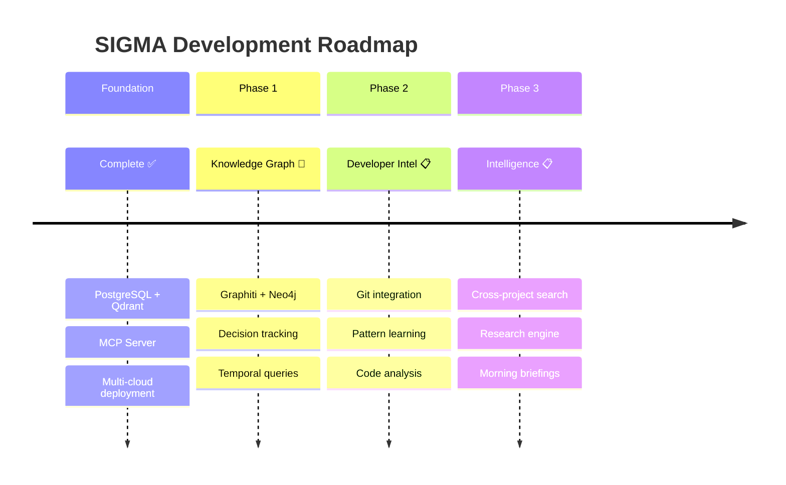
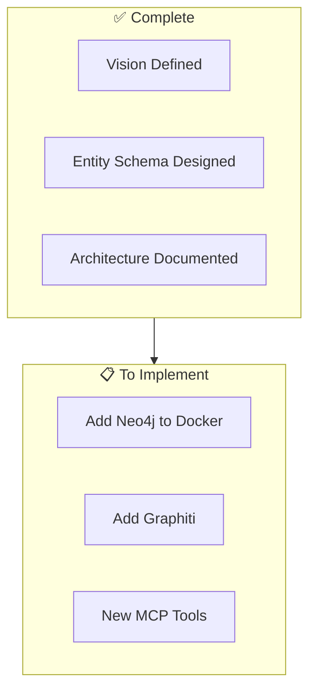
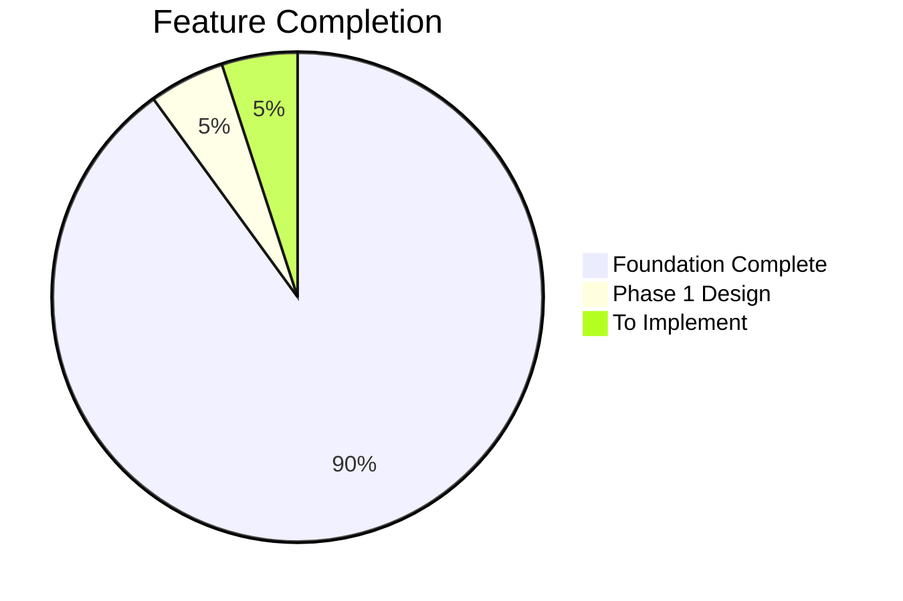

# Progress: SIGMA - The Self-Evolving Developer Intelligence System

## Vision Summary

**SIGMA** = **S**elf-evolving **I**ntelligence for **G**raphs, **M**emory & **A**nalysis

*"Your code's memory, evolving with every commit"*

A developer-focused AI that learns your codebase, patterns, and decisions over time - building an ever-growing knowledge graph that makes it exponentially more useful the longer you work together.

## What Works (Foundation Complete)

### Core Memory Operations ✅
- **Add Memories**: Store text with automatic embedding generation
- **Search Memories**: Semantic vector search with fallback to text search
- **List Memories**: Retrieve all accessible memories for a user/app
- **Delete Memories**: Bulk deletion with audit trail

### Data Storage ✅
- **PostgreSQL Database**: Full relational schema with migrations
- **Qdrant Vector Store**: Semantic search with OpenAI embeddings
- **Dual Storage Pattern**: PostgreSQL as source of truth, Qdrant for search

### Multi-Tenancy ✅
- **User Management**: Automatic user creation on first use
- **App Management**: Multiple apps per user with isolation
- **Access Control**: ACL-based permissions for memory access

### MCP Server ✅
- **SSE Transport**: Server-Side Events for real-time communication
- **7 MCP Tools**: Fully implemented and working
- **Graceful Degradation**: Fallback when dependencies unavailable

### Infrastructure ✅
- **Docker Compose**: Complete local development stack
- **AWS Deployment**: CloudFormation templates for ECS
- **DigitalOcean Deployment**: App Platform configuration

### Observability ✅
- **Structured Logging**: JSON logs via th_logging
- **Access Logging**: Track all memory operations
- **Health Checks**: ALB-compatible endpoints

## Implementation Phases



## Phase 1: Knowledge Graph (In Progress)

### Status: 🔄 Planning Complete, Ready for Implementation



### Phase 1 Checklist

| Task | Status | Notes |
|------|--------|-------|
| Define developer entity types | ✅ Done | Project, File, Decision, Pattern, etc. |
| Design relationship types | ✅ Done | Contains, DependsOn, Implements, Solves |
| Document architecture | ✅ Done | systemPatterns.md |
| Add Neo4j to docker-compose | ⬜ Todo | Next step |
| Add graphiti-core dependency | ⬜ Todo | |
| Create graphiti.py utils | ⬜ Todo | Safe initialization |
| Implement track_decision tool | ⬜ Todo | First new MCP tool |
| Implement search_decisions tool | ⬜ Todo | Temporal queries |
| Test entity extraction | ⬜ Todo | |

## Phase 2: Git Integration (Planned)

### Status: 📋 Architecture Defined

| Task | Status | Notes |
|------|--------|-------|
| Design git processing flow | ✅ Done | In systemPatterns.md |
| Add GitPython dependency | ⬜ Todo | |
| Create git_integration.py | ⬜ Todo | |
| Implement ingest_project tool | ⬜ Todo | Full repo ingestion |
| Extract commit patterns | ⬜ Todo | |
| Link commits to decisions | ⬜ Todo | |
| Track library dependencies | ⬜ Todo | package.json, requirements.txt |

## Phase 3: Intelligence Layer (Planned)

### Status: 📋 Designed

| Task | Status | Notes |
|------|--------|-------|
| Design pattern learning | ✅ Done | In systemPatterns.md |
| Design research engine | ✅ Done | |
| Implement pattern_learner.py | ⬜ Todo | |
| Implement research_engine.py | ⬜ Todo | |
| Implement cross_project_search | ⬜ Todo | |
| Implement get_morning_briefing | ⬜ Todo | |
| Add autonomous scheduler | ⬜ Todo | Nightly research |

## Feature Status Matrix



| Category | Feature | Status | Phase |
|----------|---------|--------|-------|
| **Memory** | add_memories | ✅ 100% | Foundation |
| | search_memory | ✅ 100% | Foundation |
| | list_memories | ✅ 100% | Foundation |
| | delete_all_memories | ✅ 100% | Foundation |
| **Storage** | PostgreSQL | ✅ 100% | Foundation |
| | Qdrant | ✅ 100% | Foundation |
| | Neo4j | ⬜ 0% | Phase 1 |
| **Infrastructure** | Docker Compose | ✅ 100% | Foundation |
| | AWS ECS | ✅ 100% | Foundation |
| | DigitalOcean | ✅ 100% | Foundation |
| **Integrations** | Slack | ✅ 90% | Foundation |
| | Git | ⬜ 0% | Phase 2 |
| | GitHub/GitLab | ⬜ 0% | Phase 2 |
| **Intelligence** | track_decision | ⬜ 0% | Phase 1 |
| | search_decisions | ⬜ 0% | Phase 1 |
| | ingest_project | ⬜ 0% | Phase 2 |
| | get_pattern_suggestions | ⬜ 0% | Phase 3 |
| | cross_project_search | ⬜ 0% | Phase 3 |
| | get_morning_briefing | ⬜ 0% | Phase 3 |

## New Files to Create

### Phase 1 Files
```
src/openmemory/app/utils/
├── graphiti.py          # Graphiti client initialization
└── query_router.py      # Query routing logic

src/openmemory/app/routers/
└── graph.py             # Graph REST endpoints
```

### Phase 2 Files
```
src/openmemory/app/utils/
└── git_integration.py   # Git repository processing
```

### Phase 3 Files
```
src/openmemory/app/utils/
├── pattern_learner.py   # Pattern learning engine
├── research_engine.py   # Autonomous research
└── cross_project.py     # Cross-project synthesis
```

## Files to Update

| File | Changes Needed |
|------|----------------|
| `docker/docker-compose.yaml` | Add Neo4j service |
| `src/requirements.txt` | Add graphiti-core, neo4j, gitpython |
| `src/openmemory/app/mcp_server.py` | Add new MCP tools |
| `.env.example` | Add Neo4j vars, feature flags |

## Technical Decisions Made

### Entity Schema
- Decision entities track WHY choices were made
- Pattern entities track HOW you code
- Temporal metadata on all relationships
- Bi-temporal model for "what did I know when"

### Query Routing
- Simple queries → Qdrant (fast, <500ms)
- Decision/temporal queries → Neo4j (rich, <2s)
- Cross-project queries → Multi-graph (comprehensive, <3s)

### Dual-Write Strategy
- Write to both Qdrant and Neo4j in Phase 1
- Evaluate accuracy/latency differences
- Make hybrid vs replace decision later

## Open Source Updates

### Removed
- ❌ Company-specific roadmaps
- ❌ Internal timeline references
- ❌ Proprietary feature plans

### Added
- ✅ Community-driven development focus
- ✅ Self-hosting documentation
- ✅ Multi-cloud deployment options
- ✅ Open architecture decisions

## Performance Targets

| Operation | Current | Target | Phase |
|-----------|---------|--------|-------|
| Simple search | ~350ms | <500ms | ✅ Met |
| Memory add | ~1.5s | <2s | ✅ Met |
| Decision query | N/A | <2s | Phase 1 |
| Cross-project | N/A | <3s | Phase 3 |
| Morning briefing | N/A | <10s | Phase 3 |

## Next Session Priorities

1. **Start Phase 1 Implementation**
   - Add Neo4j to docker-compose
   - Add Graphiti dependencies
   - Create graphiti.py utils

2. **First New Tool**
   - Implement `track_decision` MCP tool
   - Test entity creation in Neo4j

3. **Documentation**
   - Update README with SIGMA vision
   - Add setup instructions for Neo4j
- **Architecture**: PostgreSQL + Qdrant + Neo4j/Graphiti
