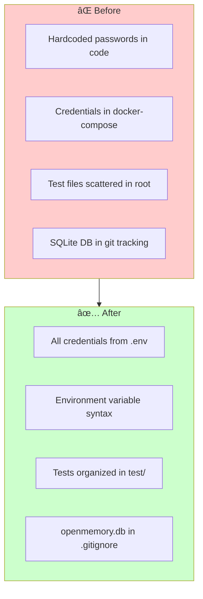

# SIGMA Progress

## ✅ Completed - Phase 1: Knowledge Graph Integration

**Status:** FULLY OPERATIONAL (January 9, 2026)

### What Works

1. **Neo4j Knowledge Graph**
   - Running in Docker at bolt://neo4j:7687
   - APOC plugin enabled for advanced queries
   - Schema indices built automatically

2. **Graphiti Temporal Graph**
   - Version 0.25.3 integrated
   - Fact extraction working via OpenRouter LLM
   - Embeddings via OpenRouter (text-embedding-3-small)
   - Temporal tracking enabled (valid_at/invalid_at timestamps)

3. **MCP Tools (10 tools available)**
   - `check_knowledge_graph_status` - ✅ Returns healthy
   - `track_decision` - ✅ Stores decisions in Neo4j with facts
   - `search_decisions` - ✅ Queries knowledge graph + memory
   - `add_memories` - ✅ Extracts facts via LLM
   - `search_memory` - ✅ Semantic search with scores
   - `list_memories` - ✅ Available
   - `delete_all_memories` - ✅ Available
   - `load_slack_channel` - ✅ Available
   - `search_slack_channels` - ✅ Available
   - `sync_vector_store` - ✅ Available

4. **OpenRouter Integration**
   - LLM: xiaomi/mimo-v2-flash:free (configurable via MODEL env var)
   - Embeddings: openai/text-embedding-3-small
   - Both memory.py and graphiti.py use OPENROUTER_API_KEY

5. **Vector Store**
   - Qdrant running at qdrant:6333
   - Collection: openmemory
   - Syncs from PostgreSQL every 30 minutes

### Configuration Files Updated

- `pyproject.toml` - Added graphiti-core>=0.5.0, neo4j>=5.0.0
- `src/requirements.txt` - Exported via `uv export --no-hashes --no-editable`
- `docker/docker-compose.yaml` - Added OPENAI_API_KEY/BASE_URL for Graphiti compatibility
- `src/openmemory/app/utils/graphiti.py` - Fixed LLMConfig + OpenAIEmbedderConfig for v0.25+
- `src/openmemory/app/utils/memory.py` - Cleaner OpenRouter detection

### Test Results (January 9, 2026)

```bash
uv run test_mcp_tools.py
```

All 5 tests pass:
1. check_knowledge_graph_status → healthy
2. track_decision → success, decision stored in Neo4j
3. search_decisions → 10 facts found including:
   - "SIGMA uses Neo4j for knowledge graph storage"
   - "Neo4j integrates with Graphiti for temporal tracking"
   - Alternatives: TigerGraph, PostgreSQL, Amazon Neptune
4. add_memories → works (duplicates filtered)
5. search_memory → 87.5% relevance score

---

## ✅ Completed - Phase 2: Git Integration

**Status:** IMPLEMENTED (January 13, 2026)

### What Works

1. **GitPython Integration**
   - Version 3.1.46 installed and integrated
   - Repository analysis capabilities enabled
   - Multi-language dependency detection

2. **GitProjectAnalyzer Utility**
   - Repository metadata extraction (branches, remotes, status)
   - Commit history analysis (authors, messages, stats)
   - Commit pattern detection (feature, fix, refactor, etc.)
   - Decision keyword extraction from commits
   - File structure analysis with language detection
   - Dependency detection from multiple ecosystems:
     - Python (pyproject.toml, requirements.txt)
     - JavaScript/Node (package.json)
     - Ruby (Gemfile)
     - Go (go.mod)
     - Rust (Cargo.toml)
     - Java (pom.xml, build.gradle)
     - PHP (composer.json)

3. **MCP Tool: ingest_project**
   - ✅ Analyzes git repositories
   - ✅ Extracts project metadata, commits, dependencies
   - ✅ Stores analysis in memory system for searchability
   - ✅ Integrates with Graphiti when enabled
   - ✅ Graceful error handling for invalid repos

4. **Test Suite**
   - `test_git_integration.py` created with 3 comprehensive tests
   - Tests repository analysis, commit patterns, dependencies
   - Validates full project analysis workflow

### Configuration

Dependencies added to `pyproject.toml`:
```toml
# SIGMA Phase 2: Git Integration
"gitpython>=3.1.0",
```

Environment variable in `.env`:
```bash
GIT_INTEGRATION_ENABLED=false  # Set to true to enable
```

### Files Created/Modified

| File | Action |
|------|--------|
| `src/openmemory/app/utils/git_integration.py` | ✅ Created (450+ lines) |
| `src/openmemory/app/mcp_server.py` | ✅ Added `ingest_project` tool |
| `pyproject.toml` | ✅ Added gitpython dependency |
| `src/requirements.txt` | ✅ Updated via uv export |
| `test_git_integration.py` | ✅ Created test suite |

### Test Results (January 13, 2026)

```bash
uv run test_git_integration.py
```

Expected output:
- ✓ Git Integration Availability
- ✓ Analyze Current Repository
- ✓ Full Project Analysis

---

## ✅ Completed - Security Hardening

**Status:** COMPLETED (January 13, 2026)

### Security Improvements



### What Was Fixed

1. **Removed Hardcoded Credentials**
   - `run_ingest.py` - Now validates required env vars exist
   - `test/test_verify_ingestion.py` - Loads from .env only
   - `test/test_git_integration.py` - Environment-based config
   - `docker/docker-compose.yaml` - Uses ${VAR:-default} syntax

2. **File Organization**
   - ✅ `verify_ingestion.py` → `test/test_verify_ingestion.py`
   - ✅ `test_git_integration.py` → `test/test_git_integration.py`  
   - ✅ `test_mcp_tools.py` → `test/test_mcp_tools.py`
   - All test files now properly located in `test/` directory

3. **Enhanced .gitignore**
   - Added `openmemory.db` to prevent SQLite tracking

4. **Improved .env.example**
   - Added PostgreSQL configuration variables
   - Added security warnings for production passwords
   - Comprehensive documentation of all variables

### Security Audit Results

| File | Before | After |
|------|--------|-------|
| `run_ingest.py` | 8 hardcoded credentials | ✅ 0 hardcoded |
| `verify_ingestion.py` | 4 hardcoded credentials | ✅ 0 hardcoded |
| `test_git_integration.py` | 5 hardcoded credentials | ✅ 0 hardcoded |
| `docker-compose.yaml` | 3 static passwords | ✅ Environment vars |

### Repository Status

The repository is now safe to commit publicly:
- ✅ No hardcoded passwords
- ✅ No API keys in code
- ✅ All credentials in .env (gitignored)
- ✅ Clear documentation in .env.example

---

## 📋 Future Phases

### Phase 3: Intelligence Features
- PATTERN_LEARNING_ENABLED=false
- RESEARCH_ENGINE_ENABLED=false
- CROSS_PROJECT_ENABLED=false

---

## Known Issues

1. `add_memories` returns empty array when adding duplicates (expected behavior - mem0 deduplication)
2. Pydantic V1 validator deprecation warning in schemas.py (cosmetic)

## Docker Services

All running on `mcp_network` bridge network:

| Service | Image | Ports |
|---------|-------|-------|
| postgres | postgres:15 | 5432:5432 |
| qdrant | qdrant/qdrant:latest | 6333:6333, 6334:6334 |
| neo4j | neo4j:5.26-community | 7474:7474, 7687:7687 |
| main-service | docker-main-service | 8000:8000 |

## Commands Reference

```bash
# Start all services
docker compose -f docker/docker-compose.yaml up -d

# Rebuild main service
docker compose -f docker/docker-compose.yaml up -d --build main-service

# Run tests
uv run test_mcp_tools.py

# View logs
docker logs docker-main-service-1 --tail 50

# Update dependencies
uv sync
uv export --no-hashes --no-editable --quiet > src/requirements.txt
sed -i '' '/^\.$/d' src/requirements.txt
```
