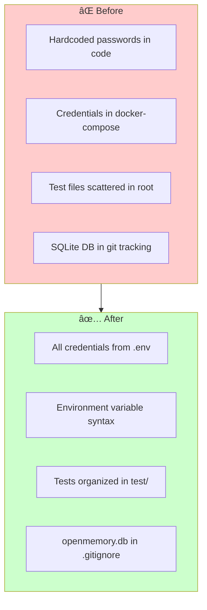
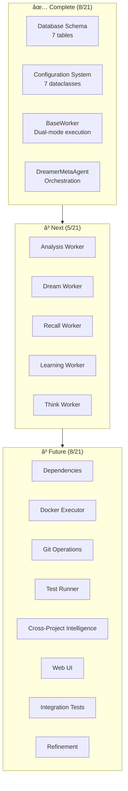

# SIGMA Progress

## ✅ Completed - Phase 1: Knowledge Graph Integration

**Status:** FULLY OPERATIONAL (January 9, 2026)

### What Works

1. **Neo4j Knowledge Graph**
   - Running in Docker at bolt://neo4j:7687
   - APOC plugin enabled for advanced queries
   - Schema indices built automatically

2. **Graphiti Temporal Graph**
   - Version 0.25.3 integrated
   - Fact extraction working via OpenRouter LLM
   - Embeddings via OpenRouter (text-embedding-3-small)
   - Temporal tracking enabled (valid_at/invalid_at timestamps)

3. **MCP Tools (10 tools available)**
   - `check_knowledge_graph_status` - ✅ Returns healthy
   - `track_decision` - ✅ Stores decisions in Neo4j with facts
   - `search_decisions` - ✅ Queries knowledge graph + memory
   - `add_memories` - ✅ Extracts facts via LLM
   - `search_memory` - ✅ Semantic search with scores
   - `list_memories` - ✅ Available
   - `delete_all_memories` - ✅ Available
   - `load_slack_channel` - ✅ Available
   - `search_slack_channels` - ✅ Available
   - `sync_vector_store` - ✅ Available

4. **OpenRouter Integration**
   - LLM: xiaomi/mimo-v2-flash:free (configurable via MODEL env var)
   - Embeddings: openai/text-embedding-3-small
   - Both memory.py and graphiti.py use OPENROUTER_API_KEY

5. **Vector Store**
   - Qdrant running at qdrant:6333
   - Collection: openmemory
   - Syncs from PostgreSQL every 30 minutes

### Configuration Files Updated

- `pyproject.toml` - Added graphiti-core>=0.5.0, neo4j>=5.0.0
- `src/requirements.txt` - Exported via `uv export --no-hashes --no-editable`
- `docker/docker-compose.yaml` - Added OPENAI_API_KEY/BASE_URL for Graphiti compatibility
- `src/openmemory/app/utils/graphiti.py` - Fixed LLMConfig + OpenAIEmbedderConfig for v0.25+
- `src/openmemory/app/utils/memory.py` - Cleaner OpenRouter detection

### Test Results (January 9, 2026)

```bash
uv run test_mcp_tools.py
```

All 5 tests pass:
1. check_knowledge_graph_status → healthy
2. track_decision → success, decision stored in Neo4j
3. search_decisions → 10 facts found including:
   - "SIGMA uses Neo4j for knowledge graph storage"
   - "Neo4j integrates with Graphiti for temporal tracking"
   - Alternatives: TigerGraph, PostgreSQL, Amazon Neptune
4. add_memories → works (duplicates filtered)
5. search_memory → 87.5% relevance score

---

## ✅ Completed - Phase 2: Git Integration

**Status:** IMPLEMENTED (January 13, 2026)

### What Works

1. **GitPython Integration**
   - Version 3.1.46 installed and integrated
   - Repository analysis capabilities enabled
   - Multi-language dependency detection

2. **GitProjectAnalyzer Utility**
   - Repository metadata extraction (branches, remotes, status)
   - Commit history analysis (authors, messages, stats)
   - Commit pattern detection (feature, fix, refactor, etc.)
   - Decision keyword extraction from commits
   - File structure analysis with language detection
   - Dependency detection from multiple ecosystems:
     - Python (pyproject.toml, requirements.txt)
     - JavaScript/Node (package.json)
     - Ruby (Gemfile)
     - Go (go.mod)
     - Rust (Cargo.toml)
     - Java (pom.xml, build.gradle)
     - PHP (composer.json)

3. **MCP Tool: ingest_project**
   - ✅ Analyzes git repositories
   - ✅ Extracts project metadata, commits, dependencies
   - ✅ Stores analysis in memory system for searchability
   - ✅ Integrates with Graphiti when enabled
   - ✅ Graceful error handling for invalid repos

4. **Test Suite**
   - `test_git_integration.py` created with 3 comprehensive tests
   - Tests repository analysis, commit patterns, dependencies
   - Validates full project analysis workflow

### Configuration

Dependencies added to `pyproject.toml`:
```toml
# SIGMA Phase 2: Git Integration
"gitpython>=3.1.0",
```

Environment variable in `.env`:
```bash
GIT_INTEGRATION_ENABLED=false  # Set to true to enable
```

### Files Created/Modified

| File | Action |
|------|--------|
| `src/openmemory/app/utils/git_integration.py` | ✅ Created (450+ lines) |
| `src/openmemory/app/mcp_server.py` | ✅ Added `ingest_project` tool |
| `pyproject.toml` | ✅ Added gitpython dependency |
| `src/requirements.txt` | ✅ Updated via uv export |
| `test_git_integration.py` | ✅ Created test suite |

### Test Results (January 13, 2026)

```bash
uv run test_git_integration.py
```

Expected output:
- ✓ Git Integration Availability
- ✓ Analyze Current Repository
- ✓ Full Project Analysis

---

## ✅ Completed - Security Hardening

**Status:** COMPLETED (January 13, 2026)

### Security Improvements



### What Was Fixed

1. **Removed Hardcoded Credentials**
   - `run_ingest.py` - Now validates required env vars exist
   - `test/test_verify_ingestion.py` - Loads from .env only
   - `test/test_git_integration.py` - Environment-based config
   - `docker/docker-compose.yaml` - Uses ${VAR:-default} syntax

2. **File Organization**
   - ✅ `verify_ingestion.py` → `test/test_verify_ingestion.py`
   - ✅ `test_git_integration.py` → `test/test_git_integration.py`  
   - ✅ `test_mcp_tools.py` → `test/test_mcp_tools.py`
   - All test files now properly located in `test/` directory

3. **Enhanced .gitignore**
   - Added `openmemory.db` to prevent SQLite tracking

4. **Improved .env.example**
   - Added PostgreSQL configuration variables
   - Added security warnings for production passwords
   - Comprehensive documentation of all variables

### Security Audit Results

| File | Before | After |
|------|--------|-------|
| `run_ingest.py` | 8 hardcoded credentials | ✅ 0 hardcoded |
| `verify_ingestion.py` | 4 hardcoded credentials | ✅ 0 hardcoded |
| `test_git_integration.py` | 5 hardcoded credentials | ✅ 0 hardcoded |
| `docker-compose.yaml` | 3 static passwords | ✅ Environment vars |

### Repository Status

The repository is now safe to commit publicly:
- ✅ No hardcoded passwords
- ✅ No API keys in code
- ✅ All credentials in .env (gitignored)
- ✅ Clear documentation in .env.example

---

## 🔄 Phase 3: Multi-Agent System (In Progress)

**Status:** FOUNDATION COMPLETE (January 14, 2026)

### What's Been Built

1. **Database Schema (7 New Tables)**
   - `projects` - Track multiple projects for cross-learning
   - `code_snapshots` - Store analysis results over time
   - `proposals` - Multi-agent committee decisions with confidence scores
   - `experiments` - Track dreaming experiments (hypothesis, outcome, improvement)
   - `learned_patterns` - Cross-project pattern library with confidence tracking
   - `cross_project_learnings` - Transfer learning records
   - `worker_stats` - Performance tracking (cycles, experiments, timing, errors)

2. **Configuration System**
   - `agent_config.py` - Comprehensive dataclass-based configuration
   - 7 configuration classes: Autonomy, Project, Workers, Execution, CrossProject, Committee, External
   - Environment variable loading with defaults
   - Singleton pattern with `get_agent_config()`
   - Validation logic (e.g., `can_execute()` for autonomy levels)

3. **Core Infrastructure**
   - `BaseWorker` - Abstract base class for all workers
     - Dual-mode operation (85% production, 15% experimental)
     - Thread-safe with jitter sleep (±10%)
     - Statistics tracking and persistence (every 10 cycles)
     - Event logging to database
     - Graceful shutdown handling
   
   - `DreamerMetaAgent` - THE CORE INNOVATION 🧬
     - Orchestrates experimentation across all workers
     - `should_experiment()` - Returns True 15% of time (configurable)
     - `propose_experiment()` - LLM-powered experiment generation
     - `record_outcome()` - Tracks success/failure with improvement %
     - Auto-promotion: Experiments with >20% improvement promoted to production
     - Pattern caching for performance
   
   - `WorkerController` - Centralized worker management
     - Start/stop coordination
     - Health monitoring
     - Graceful shutdown

4. **Environment Configuration**
   - `.env.example` updated with 10 comprehensive sections
   - 3 autonomy levels with confidence thresholds
   - 5 worker intervals (180-480 seconds)
   - Evolution settings (rate, success threshold)
   - Agent committee weights
   - Cross-project similarity thresholds
   - External intelligence flags (Context7, Playwright)

### Configuration Files Updated

| File | Changes |
|------|---------|
| `src/openmemory/alembic/versions/add_agent_system_tables.py` | ✅ Created - 7 agent tables |
| `src/openmemory/app/agent_config.py` | ✅ Created - 7 dataclass configs |
| `src/openmemory/app/agents/__init__.py` | ✅ Created - Package initialization |
| `src/openmemory/app/agents/base_worker.py` | ✅ Created - Abstract base class |
| `src/openmemory/app/agents/dreamer.py` | ✅ Created - Meta-learning agent |
| `.env.example` | ✅ Updated - 10 agent configuration sections |
| `memory-bank/projectbrief.md` | ✅ Updated - Multi-agent vision |
| `memory-bank/activeContext.md` | ✅ Updated - Agent system status |
| `memory-bank/systemPatterns.md` | ✅ Updated - Worker patterns & autonomy |
| `memory-bank/techContext.md` | ✅ Updated - Agent architecture & DB schema |
| `memory-bank/progress.md` | ✅ Updating now |

### Architecture Overview



### The Dreaming Gene Explained

Every worker inherits the ability to **experiment and learn**:

```python
class BaseWorker(ABC):
    def _loop(self):
        while self.running:
            if self.dreamer.should_experiment():  # 15% of cycles
                self._experimental_cycle()
                self.stats["experiments_run"] += 1
            else:
                self._production_cycle()
            
            self.stats["cycles_run"] += 1
```

**Key Features:**
- Experiments proposed by LLM with hypothesis, approach, metrics, rollback plan
- Success measured by improvement percentage vs baseline
- Auto-promotion when improvement > 20%
- Failed experiments inform future decisions
- Complete audit trail in database

### Worker Specifications (Not Yet Implemented)

| Worker | Interval | Production Mode | Experimental Mode |
|--------|----------|-----------------|-------------------|
| **Analysis** | 300s (5min) | Parse code, compute metrics, detect issues | Try different parsing strategies, linters |
| **Dream** | 240s (4min) | Build knowledge graph relationships | Try new relationship types, edge algorithms |
| **Recall** | 180s (3min) | Index code, provide semantic search | Try different retrieval strategies |
| **Learning** | 360s (6min) | Track outcomes, transfer patterns | Try different learning algorithms |
| **Think** | 480s (8min) | Multi-agent committee proposals | Try different agent compositions, voting |

### Autonomy Levels

**Level 1: Propose Only**
- Confidence threshold: ≥70%
- Generates proposals for manual review
- No automatic execution

**Level 2: Auto-commit**
- Confidence threshold: ≥80%
- Auto-commits to feature branches
- Creates PRs for manual review

**Level 3: Fully Autonomous**
- Confidence threshold: ≥90%
- Auto-commits, runs tests, merges PRs
- Notifies user of changes

### What's Next

**Immediate (Phase 3 Completion):**
1. Add dependencies to pyproject.toml (Docker SDK, PyGithub, radon)
2. Implement Analysis Worker + experiment engine
3. Implement Dream Worker + pattern evolution
4. Implement Recall Worker + context learning
5. Implement Learning Worker + meta-learning
6. Implement Think Worker + multi-agent committee

**Supporting Infrastructure:**
7. Build Git/GitHub operations layer (create branches, commit, PR, merge)
8. Build Docker executor for safe execution
9. Build test runner for validation
10. Build cross-project learning system

**Polish & Launch:**
11. Create web UI for monitoring and control
12. Integration testing and refinement

### Test Results

**Migration:**
```bash
cd src/openmemory
alembic upgrade head
# Expected: 7 new tables created successfully
```

**Configuration:**
```bash
uv run python -c "from openmemory.app.agent_config import get_agent_config; print(get_agent_config())"
# Expected: AgentSystemConfig with all 7 sub-configs loaded from environment
```

### Progress Tracking

**Phase 3 Status: 38% Complete (8/21 tasks)**

- [x] Requirements gathering and design
- [x] Update project brief with multi-agent vision
- [x] Update .env.example with agent configuration
- [x] Create database migration for agent tables
- [x] Create agent_config.py with dataclasses
- [x] Create agents package structure
- [x] Implement BaseWorker abstract class
- [x] Implement DreamerMetaAgent meta-learning
- [x] Update memory bank documentation
- [ ] Add dependencies to pyproject.toml
- [ ] Implement Analysis Worker
- [ ] Implement Dream Worker
- [ ] Implement Recall Worker
- [ ] Implement Learning Worker
- [ ] Implement Think Worker
- [ ] Build Git/GitHub operations layer
- [ ] Build Docker executor
- [ ] Build test runner
- [ ] Build cross-project learning system
- [ ] Create web UI
- [ ] Integration testing

---

## 📋 Phase 4: Advanced Features (Planned)

### Future Capabilities
- PATTERN_LEARNING_ENABLED - Pattern recognition and transfer
- RESEARCH_ENGINE_ENABLED - Autonomous documentation research
- CROSS_PROJECT_ENABLED - Cross-project knowledge synthesis
- IDE_EXTENSIONS - VSCode/JetBrains plugins
- AUTONOMOUS_AGENTS - Fully autonomous code improvement

---

## ✅ Completed - Dashboard Refactoring

**Status:** COMPLETE (January 15, 2026)

### What Was Built

1. **Modular Architecture**
   - Split monolithic 800+ line dashboard.html into organized modules
   - New file: dashboard.html (370 lines) - Main HTML with Alpine.js
   - 4 CSS files: base.css, components.css, tabs.css, theme.css (753 lines total)
   - 5 JS modules: dashboard.js, api.js, utils.js, projectForm.js, workerForm.js (800 lines total)

2. **New Features**
   - **Projects Tab**: Register new projects with metadata (repo URL, branch, language, framework, domain)
   - **Workers Tab**: Control panel to start/stop workers with configuration
   - Forms expanded by default for better UX
   - Alpine.js 3.x for reactive state management
   - Toast notification system
   - Keyboard shortcuts (1-5 for tabs, R for refresh)
   - LocalStorage persistence for tab selection

3. **Critical Bug Fixes**
   - Fixed CSS `.content-section { display: none; }` overriding Alpine.js `x-show` directive
   - Fixed module loading race condition (register on `window` before Alpine.js init)
   - Removed duplicate script tags causing component overwrite

4. **Documentation**
   - Created comprehensive DASHBOARD_README.md with architecture and troubleshooting

### Dashboard Structure

**Main Files:**
- `dashboard.html` (370 lines) - Main HTML with Alpine.js
- `DASHBOARD_README.md` - Comprehensive documentation

**CSS Files** (`static/css/`):
- `base.css` - Layout and containers
- `components.css` - Buttons, forms, cards
- `tabs.css` - Tab navigation
- `theme.css` - Colors and animations

**JavaScript Modules** (`static/js/`):
- `dashboard.js` - Main app logic
- `api.js` - API communication
- `utils.js` - Helper functions

**Forms** (`static/js/forms/`):
- `projectForm.js` - Project registration
- `workerForm.js` - Worker control

### Access

- **URL**: http://localhost:8000/static/dashboard.html
- **Features**: 5 tabs (Proposals, Experiments, Workers, Patterns, Projects)
- **Status**: ✅ All features working and tested in browser

---

## 🚨 Known Issues - CRITICAL

### 1. Database Schema Mismatch (BLOCKING)

**Priority:** CRITICAL - Blocks pattern learning and dashboard testing

**Issue:** The `learned_patterns` table is missing the `code_template` column.

**Impact:**
- 500 errors on `/api/agents/patterns` endpoint
- Dashboard "Patterns" tab cannot load
- Pattern learning functionality broken

**Root Cause:**
- Migration file updated with `code_template` column
- Database has NOT been re-migrated
- API model expects column that doesn't exist

**Fix Required:**
```bash
# Option 1: Drop and recreate database
cd src/openmemory
alembic downgrade base
alembic upgrade head

# Option 2: Manual repair (if downgrade not possible)
# Add missing column directly to database
```

**Files Involved:**
- `src/openmemory/alembic/versions/add_agent_system_tables.py`
- `src/openmemory/app/models.py` (LearnedPattern model)
- `src/openmemory/app/routers/agents.py` (patterns endpoint)

### 2. Minor Issues (Non-blocking)

1. `add_memories` returns empty array when adding duplicates (expected behavior - mem0 deduplication)
2. Pydantic V1 validator deprecation warning in schemas.py (cosmetic)

## Docker Services

All running on `mcp_network` bridge network:

| Service | Image | Ports |
|---------|-------|-------|
| postgres | postgres:15 | 5432:5432 |
| qdrant | qdrant/qdrant:latest | 6333:6333, 6334:6334 |
| neo4j | neo4j:5.26-community | 7474:7474, 7687:7687 |
| main-service | docker-main-service | 8000:8000 |

## Commands Reference

```bash
# Start all services
docker compose -f docker/docker-compose.yaml up -d

# Rebuild main service
docker compose -f docker/docker-compose.yaml up -d --build main-service

# Run tests
uv run test_mcp_tools.py

# View logs
docker logs docker-main-service-1 --tail 50

# Update dependencies
uv sync
uv export --no-hashes --no-editable --quiet > src/requirements.txt
sed -i '' '/^\.$/d' src/requirements.txt
```
