# Project Brief: SIGMA - Self-Evolving Agent Intelligence for Code

## Project Name & Meaning

**SIGMA (Σ)** = **S**elf-evolving **I**ntelligence for **G**it, **M**odules & **A**nalysis

Also represents:
- **Σ (Summation)**: Aggregates ALL your development knowledge across projects
- **Σ (Synthesis)**: Combines code + patterns + learnings into intelligence
- **Σ (Standard Deviation)**: Continuous measurement and improvement through experimentation
- **Σ (Systematic)**: Graph-based, structured approach to code understanding

## Core Vision

A **multi-agent AI system** that autonomously works on any software project, learning from experiments, sharing knowledge across projects, and evolving its strategies over time. Unlike static code analysis tools, **Sigma experiments, learns, and improves continuously**.

```mermaid
flowchart LR
    subgraph Traditional["Traditional Tools ❌"]
        T1[Static analysis]
        T2[One-time fixes]
        T3[No learning]
        T4[Single project scope]
    end
    
    subgraph Sigma["SIGMA ✅"]
        S1[Dynamic experimentation]
        S2[Continuous evolution]
        S3[Cross-project learning]
        S4[Self-improving agents]
    end
    
    Traditional -.->|Evolves to| Sigma
```

## The Problem with Current Code Tools

| Current Tools (Linters/Copilot) | SIGMA (The Vision) |
|--------------------------------|---------------------|
| Static rules, no learning | Learns from experiments and outcomes |
| Single project context | Shares patterns across all projects |
| No autonomy | Can propose, commit, and create PRs autonomously |
| Generic suggestions | Adapts to YOUR codebase patterns |
| No experimentation | Constantly tests new approaches |
| Isolated analysis | Multi-agent committee with specialized expertise |

## Core Innovation: The Dreaming Gene

Every worker in SIGMA has a **dual mode**:
1. **Production Mode**: Execute their core responsibility efficiently
2. **Dream Mode**: Experiment with novel approaches, learn from outcomes

This "gene" allows the system to continuously evolve and improve beyond its initial programming.

## Multi-Agent Architecture

### Specialized Agent Workers

1. **Analysis Worker** (+ Experiment Engine)
   - Parses code, computes metrics, detects issues
   - Experiments with different analysis strategies
   - Learns which approaches work best for different codebases

2. **Dream Worker** (+ Pattern Evolution)
   - Builds knowledge graph of code relationships
   - Experiments with new relationship types
   - Evolves graph structure based on utility

3. **Recall Worker** (+ Context Learning)
   - Provides semantic search across codebases
   - Experiments with retrieval strategies
   - Optimizes for relevance and speed

4. **Learning Worker** (+ Meta-Learning)
   - Tracks outcomes of all decisions
   - Learns which patterns succeed/fail
   - Transfers knowledge across projects

5. **Think Worker** (+ Strategy Evolution)
   - Coordinates specialized agents (architect, reviewer, tester, security, optimizer)
   - Generates proposals via committee consensus
   - Experiments with agent compositions and strategies

### DreamerMetaAgent

Orchestrates learning across all workers:
- Proposes experiments (15% of cycles)
- Records outcomes (success/failure)
- Promotes successful experiments to production
- Shares learnings across projects

## Autonomy Levels

**Level 1**: Analyze and propose (manual approval for everything)
**Level 2**: Auto-commit to branches, manual PR approval  
**Level 3**: Fully autonomous (creates and merges PRs based on confidence)

Configurable via `.env` with confidence thresholds per level.

## Cross-Project Intelligence

SIGMA learns from ALL projects you work on:
- Successful patterns transfer automatically
- Failed approaches are avoided in new projects
- Domain-specific knowledge accumulates (Django, React, etc.)
- Similar projects benefit from each other's learnings

## External Intelligence Integration

- **Context7 MCP**: Documentation lookup
- **Playwright MCP**: Web research capability
- **GitHub API**: Repository operations
- **Docker**: Isolated, safe execution environment

## Technical Foundation

### Current Stack
- ✅ Neo4j + Graphiti - Code knowledge graph
- ✅ PostgreSQL - Analysis data, experiments, cross-project patterns
- ✅ Qdrant - Semantic code search
- ✅ FastAPI - Web UI and API
- ✅ Docker - Isolated execution environment

### Agent Infrastructure
- 🔄 Worker thread system (5 background workers)
- 🔄 DreamerMetaAgent (orchestrates experimentation)
- 🔄 Multi-agent committee (6 specialized agents)
- 🔄 Autonomy controller (3 levels)
- 🔄 Cross-project learning system

## Success Criteria

### Technical Metrics
- Experiment success rate > 30%
- Pattern transfer accuracy > 70%
- Proposal acceptance rate > 60%
- Test pass rate after auto-commits > 95%

### User Value Metrics
- Time saved per week through automation
- Issues prevented before code review
- Successful cross-project pattern transfers
- System improvement rate over time

### Evolution Metrics
- New patterns discovered per month
- Successful experiments promoted to production
- Cross-project knowledge graph growth
- Agent strategy refinements

## Differentiation Matrix

| Feature | GitHub Copilot | SonarQube | **SIGMA** |
|---------|---------------|-----------|-----------|
| Code suggestions | ✅ Excellent | ❌ No | ✅ Context-aware |
| Static analysis | ❌ No | ✅ Excellent | ✅ Yes |
| Learning | ❌ No | ❌ No | ✅ Continuous |
| Experimentation | ❌ No | ❌ No | ✅ Built-in |
| Cross-project | ❌ No | ❌ No | ✅ Yes |
| Autonomy | ⚠️ Suggestions only | ❌ No | ✅ 3 levels |
| Multi-agent | ❌ No | ❌ No | ✅ 6 specialists |

## Use Cases

### Individual Developers
- 🧠 **Continuous learning** - System improves with every project
- 🚀 **Pattern reuse** - Successful solutions auto-suggested in new projects
- 🔬 **Safe experimentation** - System tests new approaches in isolation
- ⏱️ **Autonomous fixes** - Common issues resolved automatically

### Engineering Teams
- 🤝 **Knowledge sharing** - Learnings propagate across team projects
- 📖 **Living standards** - Best practices evolve from real outcomes
- 🔍 **Proactive quality** - Issues caught before code review
- 🎯 **Consistent patterns** - Team style emerges naturally

### Open Source Projects
- 📊 **Community patterns** - Learn from all contributors
- 💡 **Automated suggestions** - Help new contributors align with project style
- ⚡ **Issue prevention** - Common mistakes caught early
- 🏗️ **Architecture guidance** - Maintain consistency as project grows

## Positioning Statement

> SIGMA is a self-evolving multi-agent system that works on any software project, learning from experiments, sharing knowledge across codebases, and autonomously proposing or executing improvements. Unlike static analysis tools, Sigma experiments continuously, learns from outcomes, and improves its strategies over time.

## Open Source Philosophy

- Community-driven development
- Self-hostable with Docker Compose
- Multi-cloud deployment options
- Extensible agent architecture
- Transparent learning algorithms
- Privacy-first (your code stays yours)
