# Project Brief: SIGMA - The Self-Evolving Developer Intelligence System

## Project Name & Meaning

**SIGMA (Σ)** = **S**elf-evolving **I**ntelligence for **G**raphs, **M**emory & **A**nalysis

Also represents:
- **Σ (Summation)**: Aggregates ALL your development knowledge
- **Σ (Synthesis)**: Combines code + decisions + research into understanding
- **Σ (Standard Deviation)**: Continuous measurement and improvement
- **Σ (Systematic)**: Graph-based, structured approach to memory

## Core Vision

A developer-focused AI assistant that **learns your codebase, your patterns, and your domain over time**, building an ever-growing knowledge graph that makes it exponentially more useful the longer you work together. Unlike stateless AI coding assistants, **Sigma remembers, connects, and evolves**.

```mermaid
flowchart LR
    subgraph Traditional["Traditional AI Tools ❌"]
        T1[Stateless]
        T2[Generic knowledge]
        T3[No history]
        T4[Reactive only]
    end
    
    subgraph Sigma["SIGMA ✅"]
        S1[Persistent memory]
        S2[Learns YOUR patterns]
        S3[Tracks decisions]
        S4[Proactive suggestions]
    end
    
    Traditional -.->|Evolves to| Sigma
```



## The Problem with Current AI Dev Tools

| Current Tools (Cursor/Copilot) | SIGMA (The Vision) |
|-------------------------------|---------------------|
| Stateless - forgets between sessions | Persistent memory - builds knowledge over time |
| Generic coding knowledge | Learns YOUR codebase, patterns, architecture |
| Can't track why decisions were made | Tracks decision history and rationale |
| No understanding of project evolution | Understands how your project changed and why |
| Reactive only | Proactive - suggests based on learned patterns |
| No cross-project learning | Learns patterns across all your projects |

## Core Capabilities

### 1. Continuous Project Understanding
```
Developer: "Why did we decide to use Redis here instead of PostgreSQL?"

Sigma: "On March 15th, during the performance optimization sprint, 
you chose Redis because:
1. Session data needed <50ms access time (PostgreSQL was hitting 200ms)
2. You discussed this with the team in Slack - Sarah mentioned caching
3. The initial PostgreSQL implementation is in git history (commit abc123)
4. Related decision: You also moved rate limiting to Redis that week

Would you like me to review if this is still the best choice?"
```

### 2. Pattern Learning & Self-Improvement
- Learns YOUR specific coding patterns
- Tracks which suggestions you accept/reject
- Suggests refactors based on your history
- Improves entity extraction for your domain

### 3. Autonomous Research & Knowledge Synthesis
- Scans commits/PRs for new libraries
- Researches documentation and GitHub issues
- Proactively notifies about security vulnerabilities
- Builds knowledge graph entries automatically

### 4. Cross-Project Intelligence
- Finds solutions from your other projects
- Suggests patterns you've used successfully before
- Identifies reusable code across repositories
- Tracks how your patterns evolve over time

### 5. Proactive Code Health Monitoring
- Morning briefings with security alerts
- Detects accumulating tech debt
- Surfaces TODO patterns you've solved elsewhere
- Monitors performance regressions

### 6. Self-Evolving Architecture
- Tracks which AI suggestions you accept
- Identifies knowledge gaps and fills them
- Creates domain-specific entity types over time
- Optimizes queries based on your usage

## Target Users

### Individual Developers
- 🧠 **Never forget context** - "Why did I do this 6 months ago?"
- 🚀 **Reuse your patterns** - Your best solutions, auto-suggested
- 📚 **Personal knowledge base** - All learning, searchable and connected
- ⏱️ **Save context switching time** - Instant project recall

### Engineering Teams
- 🤝 **Onboarding acceleration** - New devs learn from knowledge graph
- 📖 **Living documentation** - Auto-maintained from code + decisions
- 🔍 **Architectural clarity** - Understand why systems evolved
- 🎯 **Consistency** - Team patterns propagate automatically

### Engineering Leaders
- 📊 **Tech debt visibility** - Identifies accumulating patterns
- 🏗️ **Architecture insights** - Understand system evolution
- 💡 **Knowledge retention** - Doesn't leave when developers leave
- ⚡ **Velocity metrics** - Track pattern reuse and efficiency

## Technical Foundation

### Current Stack (Foundation)
- ✅ PostgreSQL - Source of truth for relational data
- ✅ Qdrant - Vector search for semantic queries
- ✅ FastAPI - MCP server with SSE transport
- ✅ Slack Integration - Decision tracking from discussions
- ✅ Multi-cloud deployment (AWS ECS, DigitalOcean)

### Planned Additions (Developer Intelligence)
- 🔄 Graphiti + Neo4j - Temporal knowledge graph
- 🔄 Git Integration - Commit/PR/Pattern tracking
- 🔄 Jira/Linear Integration - Ticket to code connections
- 📋 Pattern Learning Engine - Accept/reject tracking
- 📋 Autonomous Research Scheduler - Nightly scans
- 📋 Cross-Project Synthesizer - Multi-repo knowledge

## Differentiation Matrix

| Feature | GitHub Copilot | Cursor | **SIGMA** |
|---------|---------------|--------|-----------|
| Code completion | ✅ Excellent | ✅ Excellent | ⚠️ Via integration |
| Codebase understanding | ❌ No memory | ⚠️ Session-based | ✅ Persistent, growing |
| Cross-project learning | ❌ No | ❌ No | ✅ Yes |
| Decision tracking | ❌ No | ❌ No | ✅ Temporal history |
| Autonomous research | ❌ No | ❌ No | ✅ Continuous |
| Pattern recognition | ⚠️ Generic | ⚠️ Generic | ✅ YOUR patterns |
| Proactive suggestions | ❌ No | ❌ No | ✅ Yes |
| Self-improvement | ❌ No | ❌ No | ✅ Evolves with usage |

## Success Criteria

### Technical Metrics
- Memory operation latency < 2s (simple), < 5s (graph queries)
- Pattern recognition accuracy > 85%
- Cross-project query response < 3s
- Autonomous research coverage > 90% of dependencies

### User Value Metrics
- Time saved per developer per week
- Successfully surfaced cross-project patterns
- Correct decision recall rate
- Morning briefing actionability score

### Adoption Metrics
- Active developers using daily
- Projects connected per user
- Pattern suggestions accepted ratio
- Knowledge graph growth rate

## Tagline Options

- **"Your code's memory, evolving with every commit"**
- "The AI assistant that grows with your codebase"
- "Never forget, always learn, continuously improve"
- "Your development knowledge, amplified"

## Positioning Statement

> SIGMA is a self-evolving developer intelligence system that builds a temporal knowledge graph of your codebase, patterns, and decisions. Unlike stateless AI coding tools, Sigma learns continuously, remembers contextually, and proactively helps you code better by understanding not just what you're building, but **how and why you build it**.

## Open Source Philosophy

- Community-driven development
- Self-hostable with Docker Compose
- Multi-cloud deployment options
- Extensible data source integrations
- Transparent pattern learning algorithms
