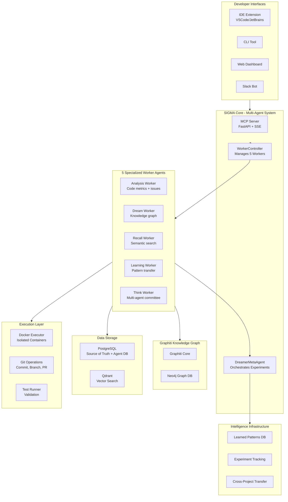
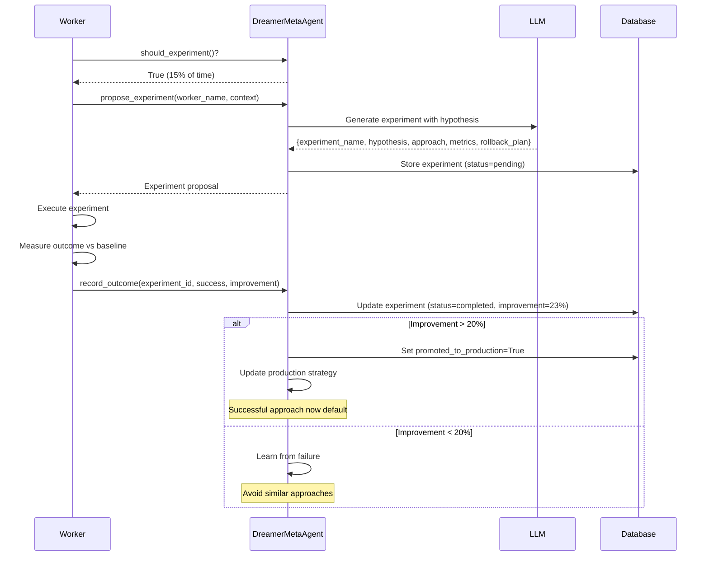
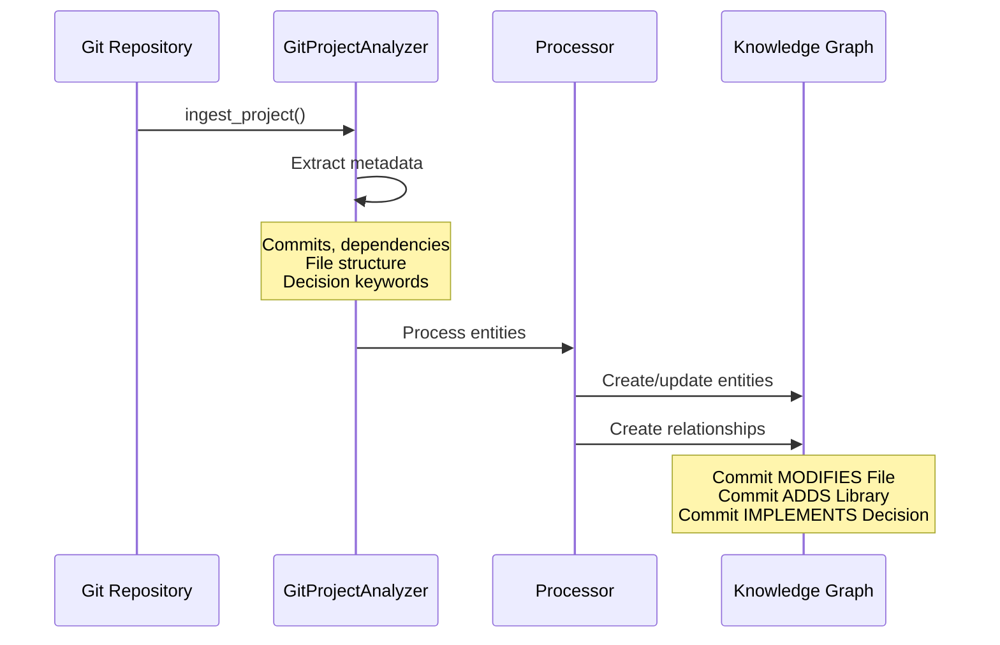
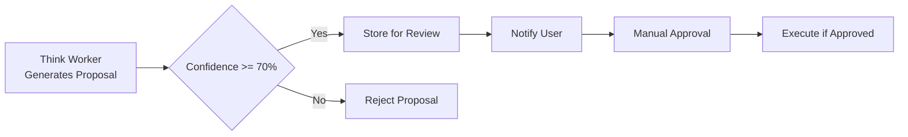
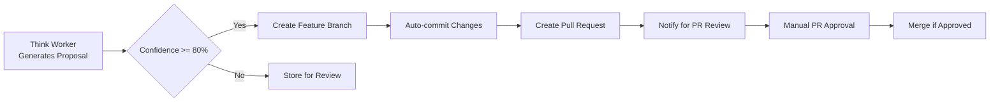
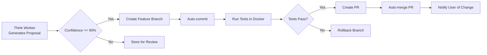
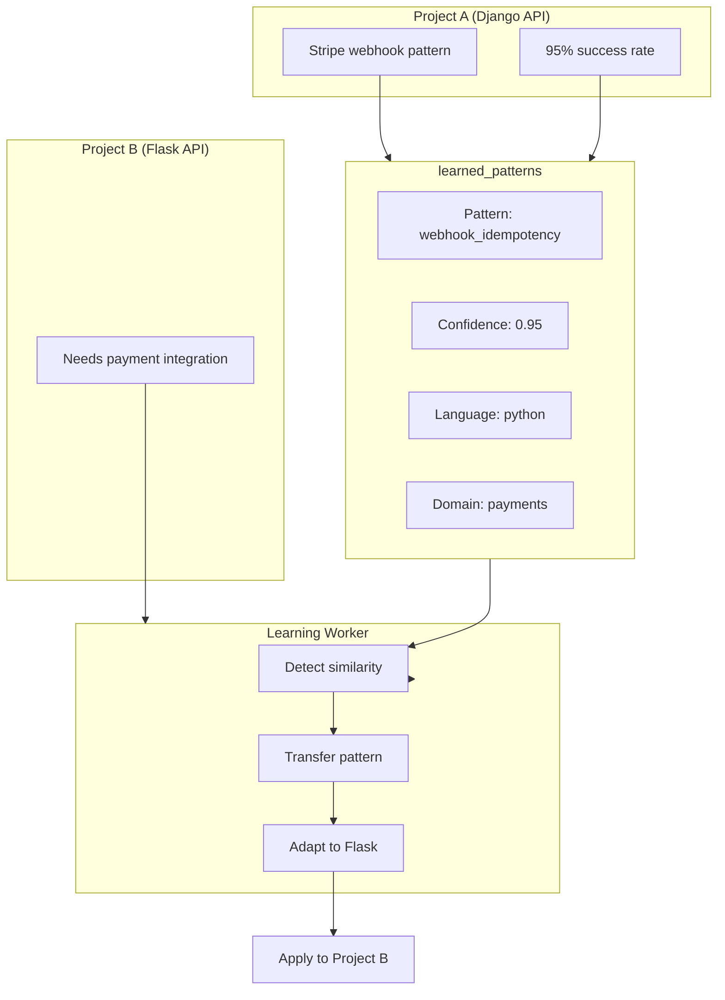

# System Patterns: SIGMA - The Self-Evolving Developer Intelligence System

## Architecture Overview

### Complete SIGMA Multi-Agent Architecture



### Data Flow - Complete Pipeline


## Developer Entity Schema

### Neo4j Entity Types

```mermaid
erDiagram
    Project ||--o{ File : contains
    Project ||--o{ Decision : has
    Project ||--o{ Pattern : uses
    Project ||--o{ Library : depends_on
    
    File ||--o{ Function : defines
    File ||--o{ Class : defines
    
    Decision ||--o{ Rationale : justified_by
    Decision }o--o{ Commit : implemented_in
    Decision }o--o{ SlackMessage : discussed_in
    
    Pattern ||--o{ PatternInstance : instantiated_as
    Pattern }o--o{ Issue : solves
    
    Library ||--o{ SecurityAlert : has
    Library }o--o{ Pattern : enables
    
    Issue ||--o{ Solution : resolved_by
    Solution }o--o{ Commit : implemented_in
    
    Developer ||--o{ Commit : authored
    Developer ||--o{ Decision : made
    Developer ||--o{ Pattern : prefers
```

### Entity Definitions

```python
# Core Developer Entities (Neo4j Labels)

class Project:
    uuid: str
    name: str
    path: str
    language: str
    framework: str
    created_at: datetime
    last_active: datetime

class File:
    uuid: str
    path: str
    language: str
    purpose: str  # Extracted or inferred
    complexity: int
    last_modified: datetime

class Function:
    uuid: str
    name: str
    signature: str
    purpose: str
    complexity: int
    line_count: int
    test_coverage: float

class Decision:
    uuid: str
    title: str
    description: str
    rationale: str
    valid_from: datetime
    valid_to: datetime  # None if current
    confidence: float
    source: str  # git, slack, manual

class Pattern:
    uuid: str
    name: str
    description: str
    category: str  # error-handling, auth, caching, etc.
    code_template: str
    usage_count: int
    success_rate: float

class Library:
    uuid: str
    name: str
    version: str
    purpose: str
    added_at: datetime
    security_status: str  # ok, warning, critical

class Issue:
    uuid: str
    title: str
    description: str
    severity: str
    status: str  # open, resolved, recurring
    created_at: datetime
    resolved_at: datetime

class Commit:
    uuid: str
    sha: str
    message: str
    files_changed: int
    additions: int
    deletions: int
    created_at: datetime
```

### Relationship Types

```mermaid
flowchart TB
    subgraph Relationships["Neo4j Relationship Types"]
        direction TB
        R1[CONTAINS - Project → File]
        R2[DEPENDS_ON - Project → Library]
        R3[IMPLEMENTS - Commit → Decision]
        R4[SOLVES - Solution → Issue]
        R5[USES - File → Pattern]
        R6[REPLACES - Decision → Decision]
        R7[DISCUSSED_IN - Decision → SlackMessage]
        R8[PREFERS - Developer → Pattern]
        R9[CAUSED_BY - Issue → Commit]
        R10[SIMILAR_TO - Pattern → Pattern]
    end
```



```python
# Relationship definitions with temporal metadata

class Relationship:
    # All relationships track:
    valid_from: datetime      # When relationship became true
    valid_to: datetime        # When relationship ended (None = current)
    created_at: datetime      # When we learned about it
    confidence: float         # How confident we are (0-1)
    source: str              # How we learned (git, slack, inferred)

# Specific relationship types
CONTAINS = "contains"         # Project contains Files
DEPENDS_ON = "depends_on"     # Project depends on Library
IMPLEMENTS = "implements"     # Commit implements Decision
SOLVES = "solves"            # Solution solves Issue
USES = "uses"                # File uses Pattern
REPLACES = "replaces"        # Decision replaces older Decision
DISCUSSED_IN = "discussed_in" # Decision discussed in SlackMessage
PREFERS = "prefers"          # Developer prefers Pattern
CAUSED_BY = "caused_by"      # Issue caused by Commit
SIMILAR_TO = "similar_to"    # Pattern similar to Pattern
```

## Intelligence Layer Architecture

### Pattern Learning Engine


```python
# Pattern Learning Engine pseudocode

class PatternLearner:
    def on_code_written(self, code: str, context: Context):
        """Extract patterns from new code"""
        patterns = self.extract_patterns(code)
        for pattern in patterns:
            self.record_pattern_usage(pattern, context)
    
    def on_suggestion_accepted(self, suggestion: Suggestion):
        """Increase pattern weight"""
        pattern = suggestion.source_pattern
        pattern.success_count += 1
        pattern.weight = self.calculate_weight(pattern)
    
    def on_suggestion_rejected(self, suggestion: Suggestion):
        """Decrease pattern weight or learn why"""
        pattern = suggestion.source_pattern
        pattern.reject_count += 1
        # If rejected with reason, learn the exception
        if suggestion.reject_reason:
            self.learn_exception(pattern, suggestion.reject_reason)
    
    def get_suggestions(self, context: Context) -> List[Suggestion]:
        """Get relevant patterns for current context"""
        relevant = self.query_patterns(context)
        scored = self.score_patterns(relevant, context)
        return self.filter_by_threshold(scored)
```

### Autonomous Research Engine


```python
# Autonomous Research Engine

class ResearchEngine:
    async def nightly_scan(self):
        """Run nightly research on recent changes"""
        # 1. Get recent commits
        commits = await self.get_recent_commits(days=1)
        
        # 2. Identify new libraries
        new_libs = self.extract_new_libraries(commits)
        
        # 3. Research each library
        for lib in new_libs:
            knowledge = await self.research_library(lib)
            await self.store_knowledge(knowledge)
            
            # Check for security issues
            if knowledge.has_security_alerts:
                await self.create_alert(lib, knowledge.alerts)
        
        # 4. Check existing libraries for updates
        await self.check_security_advisories()
        
    async def research_library(self, lib: Library) -> Knowledge:
        """Research a library and build knowledge entry"""
        # Search multiple sources
        npm_info = await self.fetch_npm_info(lib)
        github_issues = await self.fetch_github_issues(lib)
        security_db = await self.check_security_db(lib)
        
        # Synthesize findings
        return Knowledge(
            entity=lib,
            description=npm_info.description,
            known_issues=github_issues.top_issues,
            security_status=security_db.status,
            best_practices=self.extract_best_practices(github_issues),
            alternatives=self.find_alternatives(lib)
        )
```

### Cross-Project Synthesizer


```python
# Cross-Project Synthesizer

class CrossProjectSynthesizer:
    def find_similar_patterns(self, context: Context) -> List[Pattern]:
        """Find patterns from other projects that match current context"""
        # 1. Extract context signature
        signature = self.extract_signature(context)
        
        # 2. Search all projects
        candidates = []
        for project in self.user_projects:
            patterns = self.query_project_patterns(project, signature)
            candidates.extend(patterns)
        
        # 3. Rank by similarity and success
        ranked = self.rank_patterns(candidates, context)
        
        return ranked[:10]
    
    def get_cross_project_solution(self, issue: Issue) -> Solution:
        """Find solution from another project for similar issue"""
        # 1. Find similar issues
        similar = self.find_similar_issues(issue)
        
        # 2. Get solutions
        solutions = []
        for sim_issue in similar:
            if sim_issue.solutions:
                solutions.extend(sim_issue.solutions)
        
        # 3. Adapt best solution
        if solutions:
            best = self.rank_solutions(solutions)[0]
            return self.adapt_solution(best, issue.context)
```

## Query Router Pattern


### Query Classification

```python
class QueryRouter:
    def classify_query(self, query: str, context: Context) -> QueryType:
        """Classify query to determine optimal path"""
        
        # Check for temporal keywords
        if self.has_temporal_markers(query):
            # "why did we", "when was", "history of"
            return QueryType.TEMPORAL
        
        # Check for cross-project keywords
        if self.has_cross_project_markers(query):
            # "in other projects", "have I solved", "similar to"
            return QueryType.CROSS_PROJECT
        
        # Check for pattern-related
        if self.has_pattern_markers(query):
            # "best practice", "how do I usually", "pattern for"
            return QueryType.PATTERN
        
        # Check for decision-related
        if self.has_decision_markers(query):
            # "why", "decided", "chose", "rationale"
            return QueryType.DECISION
        
        # Default to semantic search
        return QueryType.SEMANTIC
    
    async def route_query(self, query: str, context: Context) -> Response:
        """Route query to appropriate handler"""
        query_type = self.classify_query(query, context)
        
        handlers = {
            QueryType.TEMPORAL: self.handle_temporal_query,
            QueryType.CROSS_PROJECT: self.handle_cross_project_query,
            QueryType.PATTERN: self.handle_pattern_query,
            QueryType.DECISION: self.handle_decision_query,
            QueryType.SEMANTIC: self.handle_semantic_query,
        }
        
        return await handlers[query_type](query, context)
```

## MCP Tools Architecture

### Current Tools (Foundation)

```mermaid
flowchart LR
    subgraph Current["Current MCP Tools ✅"]
        ADD[add_memories]
        SEARCH[search_memory]
        LIST[list_memories]
        DELETE[delete_all_memories]
        SLACK1[load_slack_channel]
        SLACK2[search_slack_channels]
        SYNC[sync_vector_store]
    end
```



### New Developer Intelligence Tools

```mermaid
flowchart LR
    subgraph DevIntel["Developer Intelligence Tools 🔄"]
        direction TB
        INGEST[ingest_project]
        DECISION[track_decision]
        SEARCH_D[search_decisions]
        PATTERN[get_pattern_suggestions]
        CROSS[cross_project_search]
        BRIEF[get_morning_briefing]
        ANALYZE[analyze_code]
    end
```



### Tool Definitions

```python
# New MCP Tools for Developer Intelligence

@mcp.tool
async def ingest_project(repo_path: str, depth: str = "full") -> str:
    """
    Ingest a Git repository into the knowledge graph.
    
    Args:
        repo_path: Path to git repository
        depth: "shallow" (latest only) or "full" (all history)
    
    Creates entities for:
    - Files, functions, classes
    - Commit history and patterns
    - Library dependencies
    - README/documentation
    """
    pass

@mcp.tool
async def track_decision(
    title: str,
    description: str,
    rationale: str,
    related_files: List[str] = None,
    alternatives_considered: List[str] = None
) -> str:
    """
    Manually track an architectural or technical decision.
    
    Creates a Decision entity with relationships to:
    - Related files
    - Current context (project, branch, etc.)
    - Alternatives considered
    """
    pass

@mcp.tool
async def search_decisions(
    query: str,
    project: str = None,
    timeframe: str = None
) -> List[Decision]:
    """
    Search past decisions with temporal context.
    
    Examples:
    - "Why did we choose Redis?"
    - "Database decisions in last 6 months"
    - "Authentication architecture changes"
    """
    pass

@mcp.tool
async def get_pattern_suggestions(
    code_context: str,
    file_path: str = None
) -> List[Suggestion]:
    """
    Get pattern suggestions based on current code context.
    
    Analyzes:
    - Current code structure
    - Your historical patterns
    - Cross-project patterns
    - Team patterns (if applicable)
    """
    pass

@mcp.tool
async def cross_project_search(
    query: str,
    include_projects: List[str] = None
) -> List[Result]:
    """
    Search across all your projects for solutions.
    
    Examples:
    - "Stripe webhook implementation"
    - "Rate limiting pattern"
    - "Similar bug to this error"
    """
    pass

@mcp.tool
async def get_morning_briefing() -> Briefing:
    """
    Get proactive morning briefing with:
    - Security alerts for dependencies
    - Pattern violations in recent code
    - Interesting findings from research
    - Suggestions for improvement
    """
    pass

@mcp.tool
async def analyze_code(
    code: str,
    analysis_type: str = "all"
) -> Analysis:
    """
    Analyze code against learned patterns.
    
    analysis_type options:
    - "patterns": Match against known patterns
    - "issues": Find potential bugs from history
    - "improvements": Suggest improvements
    - "all": All of the above
    """
    pass
```

## Multi-Agent Worker Pattern

### Worker Thread Architecture

```mermaid
flowchart TB
    subgraph Controller["WorkerController"]
        START[Start All Workers]
        MONITOR[Monitor Health]
        STOP[Graceful Shutdown]
    end
    
    subgraph Worker["BaseWorker (Each Worker)"]
        INIT[Initialize]
        LOOP[Worker Loop]
        PROD{Should Experiment?}
        PRODUCTION[Production Cycle<br/>85% of time]
        EXPERIMENTAL[Experimental Cycle<br/>15% of time]
        STATS[Track Statistics]
        SLEEP[Jitter Sleep ±10%]
    end
    
    subgraph Dreamer["DreamerMetaAgent"]
        DECIDE[should_experiment()]
        PROPOSE[propose_experiment()]
        RECORD[record_outcome()]
        PROMOTE[Auto-promote Success]
    end
    
    START --> INIT
    INIT --> LOOP
    LOOP --> PROD
    PROD -->|No| PRODUCTION
    PROD -->|Yes| EXPERIMENTAL
    PRODUCTION --> STATS
    EXPERIMENTAL --> STATS
    STATS --> SLEEP
    SLEEP --> LOOP
    
    PROD --> DECIDE
    EXPERIMENTAL --> PROPOSE
    EXPERIMENTAL --> RECORD
    RECORD --> PROMOTE
```

### BaseWorker Implementation Pattern

```python
class BaseWorker(ABC):
    """Abstract base class for all SIGMA workers.
    
    Each worker inherits:
    - Dual-mode operation (production + experimental)
    - Statistics tracking
    - Event logging
    - Graceful shutdown
    - Jitter sleep (±10%)
    """
    
    def __init__(self, db_session, dreamer: DreamerMetaAgent):
        self.db = db_session
        self.dreamer = dreamer
        self.running = False
        self.thread = None
        self.stop = threading.Event()
        self.stats = {
            "cycles_run": 0,
            "experiments_run": 0,
            "last_run": None,
            "total_time": 0,
            "errors": 0
        }
    
    @abstractmethod
    def get_interval(self) -> int:
        """Return worker interval in seconds from config"""
        pass
    
    @abstractmethod
    def _production_cycle(self):
        """Execute core responsibility efficiently"""
        pass
    
    @abstractmethod
    def _experimental_cycle(self):
        """Experiment with novel approaches"""
        pass
    
    def _loop(self):
        """Main worker loop with dual-mode execution"""
        while self.running:
            start_time = time.time()
            
            try:
                # Decide: production or experimental?
                if self.dreamer.should_experiment():
                    self._experimental_cycle()
                    self.stats["experiments_run"] += 1
                else:
                    self._production_cycle()
                
                self.stats["cycles_run"] += 1
                self.stats["last_run"] = datetime.now()
                
                # Persist stats every 10 cycles
                if self.stats["cycles_run"] % 10 == 0:
                    self._persist_stats()
                    
            except Exception as e:
                logger.error(f"Worker error: {e}")
                self.stats["errors"] += 1
            
            # Jitter sleep (±10% randomization)
            elapsed = time.time() - start_time
            self.stats["total_time"] += elapsed
            jitter_sleep(self.get_interval(), self.stop)
```

### Experiment Lifecycle



### Worker Specifications

#### Analysis Worker
```python
class AnalysisWorker(BaseWorker):
    """Analyzes code quality, metrics, and potential issues.
    
    Production Mode:
    - Parse code using AST
    - Compute complexity metrics (cyclomatic, cognitive)
    - Detect common issues (unused imports, type errors)
    - Store snapshot in code_snapshots table
    
    Experimental Mode:
    - Try different parsing strategies (AST vs Tree-sitter)
    - Experiment with different linters
    - Test new issue detection heuristics
    - Compare accuracy and false positive rates
    
    Context for Experiments:
    - false_positive_rate: float
    - missed_issues: int
    - avg_accuracy: float
    - current_strategy: str
    """
    
    def get_interval(self) -> int:
        return get_agent_config().workers.analysis_interval  # 300s (5 min)
    
    def _production_cycle(self):
        project = self._get_current_project()
        snapshot = self._analyze_codebase(project.workspace_path)
        self._store_snapshot(project.project_id, snapshot)
    
    def _experimental_cycle(self):
        context = self._get_current_performance()
        experiment = self.dreamer.propose_experiment("analysis", context)
        
        if experiment:
            exp_id = self.dreamer.record_experiment_start(
                worker_name="analysis",
                experiment_name=experiment["experiment_name"],
                hypothesis=experiment["hypothesis"],
                approach=experiment["approach"]
            )
            
            # Execute experiment
            result = self._try_experimental_approach(experiment["approach"])
            
            # Compare to baseline
            improvement = self._calculate_improvement(result, context)
            
            # Record outcome
            self.dreamer.record_outcome(
                experiment_id=exp_id,
                success=improvement > 0,
                improvement=improvement,
                details=result
            )
```

#### Dream Worker
```python
class DreamWorker(BaseWorker):
    """Builds and evolves the knowledge graph.
    
    Production Mode:
    - Extract entities from code (files, functions, classes)
    - Build relationships (depends_on, similar_to, co_evolves)
    - Update temporal metadata (valid_from, valid_to)
    - Maintain graph indices
    
    Experimental Mode:
    - Try new relationship types
    - Experiment with edge weighting algorithms
    - Test different community detection methods
    - Optimize query performance
    
    Context for Experiments:
    - graph_density: float
    - avg_query_time: float
    - relationship_accuracy: float
    - current_algorithm: str
    """
    
    def get_interval(self) -> int:
        return get_agent_config().workers.dream_interval  # 240s (4 min)
```

#### Recall Worker
```python
class RecallWorker(BaseWorker):
    """Provides semantic search and context retrieval.
    
    Production Mode:
    - Index new code in Qdrant
    - Update embeddings for changed files
    - Maintain search indices
    - Provide fast semantic search
    
    Experimental Mode:
    - Try different retrieval strategies (pure vector vs hybrid)
    - Experiment with graph-augmented search
    - Test different embedding models
    - Optimize for relevance vs speed
    
    Context for Experiments:
    - avg_search_time: float
    - avg_relevance_score: float
    - cache_hit_rate: float
    - current_strategy: str
    """
    
    def get_interval(self) -> int:
        return get_agent_config().workers.recall_interval  # 180s (3 min)
```

#### Learning Worker
```python
class LearningWorker(BaseWorker):
    """Tracks outcomes and transfers knowledge across projects.
    
    Production Mode:
    - Monitor proposal acceptance rates
    - Update pattern confidence scores
    - Transfer successful patterns to similar projects
    - Maintain learned_patterns table
    
    Experimental Mode:
    - Try different confidence decay algorithms
    - Experiment with ensemble learning methods
    - Test different similarity metrics for transfer
    - Optimize adaptation speed
    
    Context for Experiments:
    - pattern_accuracy: float
    - false_positive_rate: float
    - adaptation_speed: float
    - current_algorithm: str
    """
    
    def get_interval(self) -> int:
        return get_agent_config().workers.learning_interval  # 360s (6 min)
```

#### Think Worker
```python
class ThinkWorker(BaseWorker):
    """Coordinates multi-agent committee for proposals.
    
    Production Mode:
    - Gather insights from other workers
    - Run multi-agent committee (architect, reviewer, tester, security, optimizer)
    - Generate weighted consensus proposal
    - Check autonomy level and execute if allowed
    
    Experimental Mode:
    - Try different agent compositions
    - Experiment with voting mechanisms
    - Test different prompt variations
    - Optimize for proposal quality
    
    Context for Experiments:
    - proposal_acceptance_rate: float
    - avg_confidence: float
    - quality_score: float
    - current_composition: List[str]
    """
    
    def get_interval(self) -> int:
        return get_agent_config().workers.think_interval  # 480s (8 min)
    
    def _production_cycle(self):
        # Get current codebase state from other workers
        analysis = self._get_latest_analysis()
        patterns = self._get_applicable_patterns()
        
        # Run multi-agent committee
        committee_config = get_agent_config().committee
        proposal = self._run_committee(
            agents=committee_config.agents,
            weights=committee_config.weights,
            analysis=analysis,
            patterns=patterns
        )
        
        # Check if we can execute
        autonomy = get_agent_config().autonomy
        can_execute, reason = autonomy.can_execute(proposal.confidence)
        
        if can_execute:
            self._execute_proposal(proposal)
        else:
            self._store_proposal_for_review(proposal, reason)
```

## Data Source Integrations

### Git Integration (Existing)



```python
# Git Integration

class GitIntegration:
    async def process_commit(self, commit: GitCommit):
        """Process a git commit and extract knowledge"""
        # 1. Extract changed files
        for file in commit.files:
            await self.process_file_change(file, commit)
        
        # 2. Detect new libraries
        if commit.affects("package.json", "requirements.txt", "Gemfile"):
            await self.process_dependency_changes(commit)
        
        # 3. Extract patterns from message
        patterns = self.extract_patterns_from_message(commit.message)
        
        # 4. Link to related decisions
        decisions = self.find_related_decisions(commit)
        
        # 5. Store in knowledge graph
        await self.store_commit_knowledge(commit, patterns, decisions)
    
    async def ingest_repository(self, repo_path: str):
        """Full repository ingestion"""
        repo = git.Repo(repo_path)
        
        # Process all commits
        for commit in repo.iter_commits():
            await self.process_commit(commit)
        
        # Analyze code patterns
        await self.analyze_codebase_patterns(repo_path)
        
        # Extract documentation
        await self.extract_documentation(repo_path)
```

### Slack Integration (Enhanced)


```python
# Enhanced Slack Integration for Decisions

class SlackDecisionExtractor:
    decision_patterns = [
        r"we decided to",
        r"let's go with",
        r"the plan is to",
        r"after discussing",
        r"agreed on",
        r"rationale:",
        r"because we need",
    ]
    
    async def extract_decisions(self, messages: List[Message]) -> List[Decision]:
        """Extract decisions from Slack messages"""
        decisions = []
        
        for msg in messages:
            if self.is_decision_message(msg):
                decision = Decision(
                    title=self.extract_title(msg),
                    description=self.extract_description(msg),
                    rationale=self.extract_rationale(msg.thread),
                    discussed_in=msg,
                    participants=self.get_thread_participants(msg),
                    valid_from=msg.timestamp,
                )
                decisions.append(decision)
        
        return decisions
```

## Graceful Degradation


## Multi-Cloud Deployment


## Autonomy Levels

### Level 1: Propose Only



**Configuration:**
```bash
AGENT_AUTONOMY_LEVEL=1
AGENT_MIN_CONFIDENCE_LEVEL_1=0.70
AGENT_CAN_COMMIT=false
AGENT_CAN_MERGE_PR=false
```

### Level 2: Auto-commit to Branches



**Configuration:**
```bash
AGENT_AUTONOMY_LEVEL=2
AGENT_MIN_CONFIDENCE_LEVEL_2=0.80
AGENT_CAN_COMMIT=true
AGENT_CAN_MERGE_PR=false
```

### Level 3: Fully Autonomous



**Configuration:**
```bash
AGENT_AUTONOMY_LEVEL=3
AGENT_MIN_CONFIDENCE_LEVEL_3=0.90
AGENT_CAN_COMMIT=true
AGENT_CAN_MERGE_PR=true
```

## Cross-Project Learning Pattern



## Performance Targets

| Operation | Target Latency | Description |
|-----------|---------------|-------------|
| Worker cycle | Variable | 180s-480s depending on worker |
| Experiment generation | < 5s | LLM call to propose experiment |
| Simple memory search | < 500ms | Vector search in Qdrant |
| Decision history query | < 2s | Temporal graph traversal |
| Cross-project search | < 3s | Multi-graph query |
| Pattern suggestion | < 1s | Pattern engine lookup |
| Full repo ingestion | < 5min | 10K file repository |
| Multi-agent committee | < 30s | 5-agent consensus with LLM calls |
